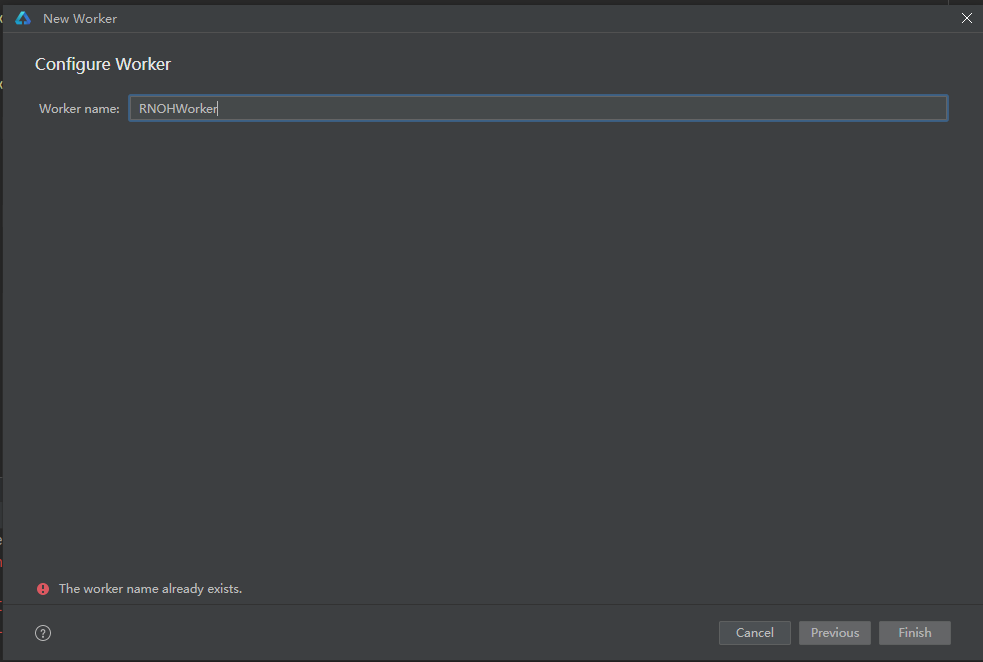

This documentation is based on React Native documentation licensed under the [CC-BY-4.0](https://creativecommons.org/licenses/by/4.0/) license at https://reactnative.cn/docs/0.72/the-new-architecture/pillars-turbomodules. © Meta Platforms Inc. Changed to How to create a TurboModule on OpenHarmony.

# 自定义TurboModule的实现

## ArkTS TurboModule的实现

### 目录结构

您可以将 TurboModule 声明为一个模块，并作为一个依赖的方式添加到您的项目中。

您可以在 React Native 工程 MyApp 的同级创建一个名为 `RTNCalculator` 的目录，并创建一个 `src/specs` 子目录，并根据使用的 Codegen 的版本不同，分别创建 `v1`、`v2` 子目录，创建后的目录结构是这样的：
```
├── MyApp
└── RTNCalculator
    └── src
        └── specs
            ├── v1
            └── v2
```

### 声明 JavaScript 接口

在 `RTNCalculator` 目录下新建 `index.ts`，并导出接口声明文件。接口声明文件 NativeCalculator.ts 根据您的需要，放置在 `v1` 或 `v2` 目录下，本示例放在了 `V2` 路径下。接口声明文件可以使用 [Flow](https://flow.org/) 或 [TypeScript](https://www.typescriptlang.org/) 语言编写。

```typescript
// index.ts
import NativeCalculator from "./src/specs/v2/NativeCalculator";

export const RTNCalculator = NativeCalculator;
```

> npm 不会打包空文件夹，需要通过在 v1 中实现 `.gitkeep` 的方式保留该目录。

对文件的建议和要求如下：

- 建议文件命名为 `Native<MODULE_NAME>`；
- 代码中必须输出 `TurboModuleRegistrySpec` 对象。

```javascript
// NativeCalculator.ts
import type {TurboModule} from 'react-native/Libraries/TurboModule/RCTExport';
import {TurboModuleRegistry} from 'react-native';

export interface Spec extends TurboModule {
  add(a: number, b: number): Promise<number>;
}

export default TurboModuleRegistry.get<Spec>(
  'RTNCalculator',
) as Spec | null;
```

### 模块配置
在 `RTNCalculator` 目录下新增 `package.json`：
```json
{
  "name": "rtn-calculator",
  "version": "1.0.0",
  "description": "Add numbers with TurboModules",
  "main": "index.ts",
  "keywords": [],
  "author": "<Your Name> <your_email@your_provider.com> (https://github.com/<your_github_handle>)",
  "license": "ISC",
  "harmony": {
    "alias": "rtn-calculator",
    "codegenConfig": [
      {
        "version": 1,
        "specPaths": [
            "./src/specs/v1"
        ]
      },
      {
        "version": 2,
        "specPaths": [
          "./src/specs/v2"
        ]
      }
    ]
  },
  "files": [
    "index.ts",
    "src/*",
    "harmony.tar.gz"
  ],
  "peerDependencies": {
    "react": "*",
    "react-native": "*"
  },
  "devDependencies": {
    "@types/react": "^18.2.47",
    "react": "18.2.0",
    "react-native": "0.72.5"
  },
  "dependencies": {}
}
```
上面的文件中包含了一些通用的描述性信息，如包名，版本，作者信息等。在使用的时候，需要设置<>包裹的占位符。
同时，OpenHarmony 平台的配置声明使用的是 `harmony` 字段，里面包含两个字段：
  - `alias`：模块的别名
  - `codegenConfig`：存放要生成的第三方库的对象数组，每个对象又包含两个字段：
    - `version`：该三方库使用的Codegen版本，取值：{1，2}
    - `specPaths`：用于找到接口声明文件的相对路径


### 原生代码

#### 使用Codegen生成原生代码

> Codegen自动生成的胶水代码会覆盖本地实现的胶水代码。

Codegen 的详细使用方法，可以参考[Codegen](Codegen.md)文档。

1. 原工程添加命令。
   
    需要在 `MyApp` 的 `package.json` 中，添加 Codegen 相关 Script：
    ```diff
    {
      "name": "MyApp",
      "version": "0.0.1",
      "private": true,
      "scripts": {
        ···
    +  "codegen": "react-native codegen-harmony --cpp-output-path ./entry/src/main/cpp/generated --rnoh-module-path ./entry/oh_modules/@rnoh/react-native-openharmony"
      },
      ···
    }
    ```
2. 调用脚本生成代码。

    > npm 不会打包空文件夹，可以通过在空目录中实现 `.gitkeep` 的方式保留该目录。
    ```bash
    cd RTNCalculator
    npm pack
    cd ../MyApp
    npm i file:../RTNCalculator/rtn-calculator-1.0.0.tgz
    npm run codegen
    ```

      
   执行成功后，将生成的胶水代码拷贝到您的harmony工程中即可。


#### 编写原生代码

1. 创建用于实现模块的 `CalculatorModule.ts`。

    在 `entry/src/main/ets` 路径下新建文件夹 `turbomodule`，并在文件夹中新增 `CalculatorModule.ts`。
    如果是 ArkTSTurboModule，需要在此处实现：

    ```typescript
    // entry/src/main/ets/turbomodule/CalculatorModule.ts
    import { AnyThreadTurboModule, UITurboModule } from '@rnoh/react-native-openharmony/ts';
    import { TM } from '@rnoh/react-native-openharmony/generated/ts';

    export class CalculatorModule extends UITurboModule implements TM.RTNCalculator.Spec {
      add(a: number, b: number): Promise<number>{
        return Promise.resolve(a+b);
      }
    }
    ```
    如果是 cxxTurboModule，不需要在此处实现，只需保证函数的参数类型和返回类型正确即可：

    ```typescript
    // entry/src/main/ets/turbomodule/CalculatorModule.ts
    import { AnyThreadTurboModule, UITurboModule } from '@rnoh/react-native-openharmony/ts';
    import { TM } from '@rnoh/react-native-openharmony/generated/ts';

    export class CalculatorModule extends UITurboModule implements TM.RTNCalculator.Spec {
      add(a: number, b: number): Promise<number>{
        return Promise.resolve(123456);
      }
    }
    ```
2. 创建 Package 的实现文件 `GeneratedPackage.ets`。

    在 `entry/src/main/ets` 路径下新建 `GeneratedPackage.ets`，并添加对应的实现代码：
    ```typescript
    // entry/src/main/ets/GeneratedPackage.ets
    import {
      RNOHPackage,
      AnyThreadTurboModule,
      AnyThreadTurboModuleContext,
      UITurboModule,
      UITurboModuleContext
    } from '@rnoh/react-native-openharmony';

    import { TM } from "@rnoh/react-native-openharmony/generated"
    import { CalculatorModule } from './turbomodule/CalculatorModule';

    export default class GeneratedPackage extends RNOHPackage {
      override getUITurboModuleFactoryByNameMap(): Map<string, (ctx: UITurboModuleContext) => UITurboModule | null> {
        return new Map<string, ((ctx: UITurboModuleContext) => UITurboModule)>()
          .set(TM.RTNCalculator.NAME, (ctx) => new CalculatorModule(ctx))
      }

      override async createEagerUITurboModuleByNameMap(ctx: UITurboModuleContext): Promise<Map<string, UITurboModule>> {
        const calculatorModule = new CalculatorModule(ctx);
        return new Map()
          .set(TM.RTNCalculator.NAME, calculatorModule)
      }
    }
    ```
    需要注意的是：
    - 文件中应该使用 `export default` 导出一个继承了 `RNOHPackage` 的类
    - 重写父类方法 `getUITurboModuleFactoryByNameMap()` 和 `createEagerUITurboModuleByNameMap()`
    - 在 `entry/src/main/ets/RNPackagesFactory.ets` 中添加创建该 Package 的方法：
      ```typescript
      import { RNOHPackage, RNPackageContext } from '@rnoh/react-native-openharmony';
      import  GeneratedPackage  from './GeneratedPackage';

      export function createRNPackages(ctx: RNPackageContext): RNOHPackage[] {
        return [
          new GeneratedPackage(ctx)
        ];
      }
      ```
3. 如果是 CxxTurboModule，需要一些额外步骤：

   什么是：CxxTurboModule，请参考[React Native 中文网](https://reactnative.cn/docs/0.72/the-new-architecture/cxx-cxxturbomodules)。

   以 CalculatorModule 为例，展开胶水代码文件 `RTNCalculator.cpp` 中的宏 ARK_ASYNC_METHOD_METADATA：

    ```diff
    #include "RTNCalculator.h"

    namespace rnoh {
    using namespace facebook;

    RTNCalculator::RTNCalculator(const ArkTSTurboModule::Context ctx, const std::string name) : ArkTSTurboModule(ctx, name) {
        methodMap_ = {
    -       ARK_ASYNC_METHOD_METADATA(add, 2),
    +       { "add",
    +         { 2,
    +           [] (facebook::jsi::Runtime& rt, facebook::react::TurboModule& turboModule, const facebook::jsi::Value* args, size_t count) {
    +             return static_cast<ArkTSTurboModule&>(turboModule).callAsync(rt, "add", args, count);
    +           } 
    +         } 
    +       }
        };
    }

    } // namespace rnoh

    ```

    删除 lambda 表达式中对 ArkTSTurboModule 的异步桥接调用，改为直接实现。

    ```diff
    #include "RTNCalculator.h"

    namespace rnoh {
    using namespace facebook;

    RTNCalculator::RTNCalculator(const ArkTSTurboModule::Context ctx, const std::string name) : ArkTSTurboModule(ctx, name) {
        methodMap_ = {
           { "add",
             { 2,
               [] (facebook::jsi::Runtime& rt, facebook::react::TurboModule& turboModule, const facebook::jsi::Value* args, size_t count) {
    -             return static_cast<ArkTSTurboModule&>(turboModule).callAsync(rt, "add", args, count);
    +             return jsi::Value(args[0].asNumber() + args[1].asNumber());
               } 
             } 
           }
        };
    }

    } // namespace rnoh

    ```

4. 添加胶水代码。根据您所使用的 Codegen 版本不同，有2种操作方式：
#### v1版本
1. 在 `CMakeLists.txt` 中添加新增的胶水代码文件
   
    在 `entry/src/main/cpp/CMakeLists.txt` 中定义 cpp 的 generated 路径，并添加到编译构建中：
    ```diff
    project(rnapp)
    cmake_minimum_required(VERSION 3.4.1)
    set(CMAKE_SKIP_BUILD_RPATH TRUE)
    set(OH_MODULE_DIR "${CMAKE_CURRENT_SOURCE_DIR}/../../../oh_modules")
    set(RNOH_APP_DIR "${CMAKE_CURRENT_SOURCE_DIR}")

    set(RNOH_CPP_DIR "${OH_MODULE_DIR}/@rnoh/react-native-openharmony/src/main/cpp")
    set(RNOH_GENERATED_DIR "${CMAKE_CURRENT_SOURCE_DIR}/generated")
    set(CMAKE_ASM_FLAGS "-Wno-error=unused-command-line-argument -Qunused-arguments")
    set(CMAKE_CXX_FLAGS "-fstack-protector-strong -Wl,-z,relro,-z,now,-z,noexecstack -s -fPIE -pie")
    add_compile_definitions(WITH_HITRACE_SYSTRACE)
    set(WITH_HITRACE_SYSTRACE 1) # for other CMakeLists.txt files to use

    add_subdirectory("${RNOH_CPP_DIR}" ./rn)

    # RNOH_BEGIN: add_package_subdirectories
    add_subdirectory("${OH_MODULE_DIR}/@rnoh/sample-package/src/main/cpp" ./sample-package)
    # RNOH_END: add_package_subdirectories

    + file(GLOB GENERATED_CPP_FILES "./generated/*.cpp")
    add_library(rnoh_app SHARED
    +     ${GENERATED_CPP_FILES}
        "./PackageProvider.cpp"
        "${RNOH_CPP_DIR}/RNOHAppNapiBridge.cpp"
    )

    target_link_libraries(rnoh_app PUBLIC rnoh)

    # RNOH_BEGIN: link_packages
    target_link_libraries(rnoh_app PUBLIC rnoh_sample_package)
    # RNOH_END: link_packages
    ```
2. 在 `entry/src/main/cpp/PackageProvider.cpp` 中创建 cpp 侧的 package 对象：
    ```diff
    #include "RNOH/PackageProvider.h"
    #include "SamplePackage.h"
    + #include "generated/RNOHGeneratedPackage.h"

    using namespace rnoh;

    std::vector<std::shared_ptr<Package>> PackageProvider::getPackages(Package::Context ctx) {
        return {
    +         std::make_shared<RNOHGeneratedPackage>(ctx), 
            std::make_shared<SamplePackage>(ctx)
        };
    }
    ```
#### v2版本

1. 在 `CMakeLists.txt` 中添加新增的胶水代码文件
   
   在这一步，需要在 CMake 文件中把 Codegen 生成的文件分别使用 `add_library` 和 `target_include_directories` 添加到编译构建的任务中：
    ```diff
    project(rnapp)
    cmake_minimum_required(VERSION 3.4.1)
    set(CMAKE_SKIP_BUILD_RPATH TRUE)
    set(OH_MODULE_DIR "${CMAKE_CURRENT_SOURCE_DIR}/../../../oh_modules")
    set(RNOH_APP_DIR "${CMAKE_CURRENT_SOURCE_DIR}")

    set(RNOH_CPP_DIR "${OH_MODULE_DIR}/@rnoh/react-native-openharmony/src/main/cpp")
    + set(RNOH_GENERATED_DIR "${CMAKE_CURRENT_SOURCE_DIR}/generated")
    set(CMAKE_ASM_FLAGS "-Wno-error=unused-command-line-argument -Qunused-arguments")
    set(CMAKE_CXX_FLAGS "-fstack-protector-strong -Wl,-z,relro,-z,now,-z,noexecstack -s -fPIE -pie")
    add_compile_definitions(WITH_HITRACE_SYSTRACE)
    set(WITH_HITRACE_SYSTRACE 1) # for other CMakeLists.txt files to use

    add_subdirectory("${RNOH_CPP_DIR}" ./rn)

    # RNOH_BEGIN: add_package_subdirectories
    add_subdirectory("${OH_MODULE_DIR}/@rnoh/sample-package/src/main/cpp" ./sample-package)
    # RNOH_END: add_package_subdirectories

    + set(rtn_calculator_generated_dir "${RNOH_GENERATED_DIR}/rtn_calculator")
    + file(GLOB_RECURSE rtn_calculator_generated_dir_SRC "${rtn_calculator_generated_dir}/**/*.cpp")
    + file(GLOB rtn_calculator_package_SRC CONFIGURE_DEPENDS *.cpp)
    add_library(rnoh_app SHARED
    +     ${rtn_calculator_generated_dir_SRC}
    +     ${rtn_calculator_package_SRC}
        "./PackageProvider.cpp"
        "${RNOH_CPP_DIR}/RNOHAppNapiBridge.cpp"
    )

    + target_include_directories(rnoh_app PUBLIC ${rtn_calculator_generated_dir})

    target_link_libraries(rnoh_app PUBLIC rnoh)

    # RNOH_BEGIN: link_packages
    target_link_libraries(rnoh_app PUBLIC rnoh_sample_package)
    # RNOH_END: link_packages
    ```
2. 在 `entry/src/main/cpp/PackageProvider.cpp` 中创建 cpp 侧的 package 对象：
   
   ```diff
   #include "RNOH/PackageProvider.h"
   #include "SamplePackage.h"
   + #include "generated/rtn_calculator/RNOH/generated/BaseRtnCalculatorPackage.h"

   using namespace rnoh;

   std::vector<std::shared_ptr<Package>> PackageProvider::getPackages(Package::Context ctx) {
       return {
           std::make_shared<SamplePackage>(ctx),
   +         std::make_shared<BaseRtnCalculatorPackage>(ctx)
       };
   }
    ```

#### 设置自定义TurboModule运行在worker线程

1. 将 `CalculatorModule` 的基类从 `UITurboModule` 改为 `AnyThreadTurboModule`
   ```typescript
   // entry/src/main/ets/turbomodule/CalculatorModule.ts
   import { AnyThreadTurboModule, UITurboModule } from '@rnoh/react-native-openharmony/ts';
   import { TM } from '@rnoh/react-native-openharmony/generated/ts';

   export class CalculatorModule extends AnyThreadTurboModule implements TM.RTNCalculator.Spec {
     add(a: number, b: number): Promise<number>{
       return Promise.resolve(a+b);
     }
   }
   ```
2. 将重写的父类方法从 `getUITurboModuleFactoryByNameMap()` 和 `createEagerUITurboModuleByNameMap()` 分别换成 `getAnyThreadTurboModuleFactoryByNameMap()` 和 `createEagerAnyThreadTurboModuleByNameMap()`
   ```typescript
   // entry/src/main/ets/GeneratedPackage.ets
   import {
     RNOHPackage,
     AnyThreadTurboModule,
     AnyThreadTurboModuleContext,
     UITurboModule,
     UITurboModuleContext
   } from '@rnoh/react-native-openharmony';

   import { TM } from "@rnoh/react-native-openharmony/generated"
   import { CalculatorModule } from './turbomodule/CalculatorModule';
   
   export default class GeneratedPackage extends RNOHPackage {
     override getAnyThreadTurboModuleFactoryByNameMap(): Map<string, (ctx: AnyThreadTurboModuleContext) => AnyThreadTurboModule | null> {
       return new Map<string, ((ctx: AnyThreadTurboModuleContext) => AnyThreadTurboModule)>()
         .set(TM.RTNCalculator.NAME, (ctx) => new CalculatorModule(ctx))
     }

     override async createEagerAnyThreadTurboModuleByNameMap(ctx: AnyThreadTurboModuleContext): Promise<Map<string, AnyThreadTurboModule>> {
       const calculatorModule = new CalculatorModule(ctx);
       return new Map()
         .set(TM.RTNCalculator.NAME, calculatorModule)
     }
   }
   ```
3. 配置TurboModule运行在worker线程,需要继承RNability后重载 `getRNOHWorkerScriptUrl` ，代码修改方式如下所示：
   ```typescript
   // entry/src/main/ets/entryability/EntryAbility.ets
   import {RNAbility} from '@rnoh/react-native-openharmony';

   export default class EntryAbility extends RNAbility {
   +  override getRNOHWorkerScriptUrl() {
   +    return "entry/ets/workers/RNOHWorker.ets"
   +  }
   ...
   }
   ```
  在ets路径下右击，选择 `New` 选项，右侧展开菜单选择 `Woker` 选项：

    
  选择后在弹出的窗口中取名 `RNOHWorker.ets`：

     
  此时目录结构为:
   ```
   └── ets
       ├── entryability
       ├── page
       ├── rn
       └── workers
           └── RNOHWorker.ets         
   ```
开发中，当需要开启 Worker 线程以优化 React Native 应用性能时，需通过 `RNOHWorker.ets` 配置 Worker 线程的核心参数。以下是完整的配置代码及参数说明，包含可选的 `HttpClient` 自定义与 `caPathProvider` 证书路径规则配置，并明确线程间配置的独立性及 `rnInstanceName` 的使用方式。


##### 1. 完整配置代码
```typescript
// entry/src/main/ets/worker/RNOHWorker.ets
import { setupRNOHWorker } from "@rnoh/react-native-openharmony/src/main/ets/setupRNOHWorker";
import { createRNPackages } from '../RNPackagesFactory';
// （可选）按需导入 HttpClient 与 CAPathProvider 相关类型/实现
import type { HttpClient, CAPathProvider } from "@rnoh/react-native-openharmony/src/main/ets/types";

// --------------------------
// （可选）1. 自定义 HttpClient 实现（支持按 rnInstanceName 差异化配置）
// --------------------------
const createCustomHttpClient = (rnInstanceName: string): HttpClient => {
  // 根据实例名称返回不同的 HttpClient 配置
  if (rnInstanceName === "mainInstance") {
    return {
      addResponseInterceptor(interceptor) {
        console.log(`[${rnInstanceName}] Worker线程 - 注册主实例响应拦截器`);
      },
      addRequestInterceptor(interceptor) {
        console.log(`[${rnInstanceName}] Worker线程 - 注册主实例请求拦截器`);
      },
      sendRequest(url: string, requestOptions) {
        console.log(`[${rnInstanceName}] Worker线程 - 发送主实例请求：${url}`);
        return {
          cancel: () => console.log(`[${rnInstanceName}] 取消请求`),
          promise: Promise.resolve({ statusCode: 200, data: "主实例响应", headers: {} })
        };
      },
      clearCookies: () => Promise.resolve(true)
    };
  } else if (rnInstanceName === "secondaryInstance") {
    return {
      addResponseInterceptor(interceptor) {
        console.log(`[${rnInstanceName}] Worker线程 - 注册次要实例响应拦截器`);
      },
      addRequestInterceptor(interceptor) {
        console.log(`[${rnInstanceName}] Worker线程 - 注册次要实例请求拦截器`);
      },
      sendRequest(url: string, requestOptions) {
        console.log(`[${rnInstanceName}] Worker线程 - 发送次要实例请求：${url}`);
        return {
          cancel: () => console.log(`[${rnInstanceName}] 取消请求`),
          promise: Promise.resolve({ statusCode: 200, data: "次要实例响应", headers: {} })
        };
      },
      clearCookies: () => Promise.resolve(true)
    };
  }
  // 默认配置
  return {
    addResponseInterceptor: () => {},
    addRequestInterceptor: () => {},
    sendRequest: () => ({ cancel: () => {}, promise: Promise.resolve({ statusCode: 200, data: "", headers: {} }) }),
    clearCookies: () => Promise.resolve(true)
  };
};

// --------------------------
// （可选）2. 自定义 caPathProvider（支持按 rnInstanceName 差异化配置）
// --------------------------
const createCustomCaPathProvider = (rnInstanceName: string): CAPathProvider => {
  // 根据实例名称返回不同的证书规则
  return (url: string) => {
    if (rnInstanceName === "secureInstance") {
      // 安全实例：强制使用专用证书
      return "/data/haps/secure.cer";
    } else if (rnInstanceName === "testInstance") {
      // 测试实例：根据域名动态切换
      return url.includes("test.com") ? "/data/haps/test.cer" : "";
    }
    // 默认实例：使用系统证书
    return "";
  };
};

// --------------------------
// 3. 核心：初始化 RNOH Worker 线程（使用 rnInstanceName 实现差异化配置）
// --------------------------
setupRNOHWorker({
  createWorkerRNInstanceConfig: (rnInstanceName) => {
    // rnInstanceName 为当前 Worker 关联的实例名称，与主线程实例名一致
    
    return { 
      // 必传：第三方RN包工厂（用于注册自定义RN组件/模块）
      thirdPartyPackagesFactory: createRNPackages,

      // 可选：按实例名生成对应的 HttpClient
      httpClient: createCustomHttpClient(rnInstanceName),

      // 可选：按实例名生成对应的 CA 证书规则
      caPathProvider: createCustomCaPathProvider(rnInstanceName)
    }
  }
})
```


#####  2. 关键参数说明
`createWorkerRNInstanceConfig` 是配置 Worker 线程的核心函数，其参数 `rnInstanceName` 可用于实现与主线程配置的一致性，以下是详细说明：

| 参数/函数          | 类型/作用                                                                 | 关键说明                                                                 |
|---------------------|--------------------------------------------------------------------------|------------------------------------------------------------------------|
| `createWorkerRNInstanceConfig` | 回调函数，接收 `rnInstanceName` 并返回 `WorkerRNInstanceConfig` 对象 | 用于动态生成 Worker 线程配置，**`rnInstanceName` 与主线程对应的 **RN**  实例名称一致**，可通过该参数实现“按实例差异化配置”。 |
| `rnInstanceName`    | `string`，表示当前 Worker 关联的 **RN**  实例名称                            | 1. 与主线程中 `RNInstanceConfig` 对应的实例名一致（如 "main"、"moduleA" 等）；<br>2. 可用于区分多实例场景，确保 Worker 配置与主线程对应实例的配置逻辑一致。 |
| `thirdPartyPackagesFactory` | `(ctx: RNPackageContext) => RNPackage[]`                            | 必传，注册 React Native 自定义组件/模块的工厂函数，Worker 线程需通过此加载第三方 **RN**  能力。 |
| `httpClient`        | `HttpClient`（可选）                                                  | 仅 Worker 线程生效，可通过 `rnInstanceName` 生成与主线程对应实例匹配的网络配置（如不同实例使用不同拦截器）。 |
| `caPathProvider`    | `(url: string) => string`（可选）                                    | 仅 Worker 线程生效，可通过 `rnInstanceName` 生成与主线程对应实例匹配的证书规则（如不同实例使用不同证书路径）。 |


#####  3. 利用 `rnInstanceName` 实现线程配置一致性
在多实例场景中（如应用包含多个 **RN**  实例），`rnInstanceName` 是保证 Worker 线程与主线程配置逻辑一致的关键，具体价值如下：

###### 场景：多实例应用的差异化配置
假设主线程中存在两个 **RN**  实例：
- 实例1：`rnInstanceName = "payment"`（支付模块，需严格的证书校验）
- 实例2：`rnInstanceName = "news"`（新闻模块，使用默认CA证书）

通过 `rnInstanceName` 可在 Worker 中实现对应配置：
```typescript
createWorkerRNInstanceConfig: (rnInstanceName) => {
  return { 
    thirdPartyPackagesFactory: createRNPackages,
    // 支付实例使用专用证书，新闻实例使用默认CA证书
    caPathProvider: (url) => {
      if (rnInstanceName === "payment") {
        return "/data/haps/payment_cert.cer"; // 与主线程支付实例配置一致
      }
      return ""; // 新闻实例使用默认，与主线程一致
    },
    // 支付实例添加加密拦截器，新闻实例无需加密
    httpClient: rnInstanceName === "payment" ? paymentHttpClient : defaultHttpClient
  }
}
```

######  核心价值
- **配置对齐**：通过 `rnInstanceName` 确保 Worker 线程的 `httpClient` 和 `caPathProvider` 与主线程对应实例的配置逻辑一致（如相同的实例名使用相同的证书规则）。
- **多实例隔离**：在多 **RN**  实例场景中，避免不同实例的网络配置相互干扰（如支付实例和普通实例的证书规则严格区分）。
- **逻辑复用**：可基于 `rnInstanceName` 封装通用配置工厂函数，同时服务于主线程和 Worker 线程，减少代码冗余。


##### 4. 线程间配置独立性说明（核心）
`HttpClient` 与 `caPathProvider` 的配置在 **主线程** 和 **Worker 线程** 中完全独立，但 `rnInstanceName` 可确保两者的**配置逻辑一致**：

| 配置项          | 主线程配置位置                          | Worker 线程配置位置                          | 关键规则                                                                 |
|-----------------|-----------------------------------------|--------------------------------------------|--------------------------------------------------------------------------|
| `HttpClient`    | `RNInstanceConfig`（按实例名配置）       | `WorkerRNInstanceConfig`（通过 `rnInstanceName` 匹配配置） | 1. 配置内容独立，但可通过 `rnInstanceName` 保证“相同实例名使用相同逻辑”；<br>2. Worker 仅使用自身配置，与主线程无依赖。 |
| `caPathProvider`| `RNInstanceConfig`（按实例名配置）       | `WorkerRNInstanceConfig`（通过 `rnInstanceName` 匹配配置） | 1. 证书规则独立，但可通过 `rnInstanceName` 保证“相同实例名使用相同规则”；<br>2. Worker 仅使用自身配置，与主线程无依赖。 |


通过 `rnInstanceName` 实现的差异化配置，既能保证 Worker 线程与主线程的逻辑一致性，又能维持线程间的配置独立性，是多实例场景下的最佳实践。

### 使用TurboModule

参照 [环境搭建](./环境搭建.md#安装鸿蒙依赖包并生成bundle) 文档的方法生成 `bundle` 后，即可在您的 App 中使用 `TurboModule` 了，下面是一个使用的例子：
```javascript
/**
 * Sample React Native App
 * https://github.com/facebook/react-native
 *
 * @format
 * @flow strict-local
 */
import React from 'react';
import {useState} from 'react';
import type {Node} from 'react';
import {
  SafeAreaView,
  StatusBar,
  Text,
  Button,
} from 'react-native';
import { RTNCalculator } from 'rtn-calculator';

const App: () => Node = () => {
  const [result, setResult] = useState<number | null>(null);
  return (
    <SafeAreaView>
      <StatusBar barStyle={'dark-content'} />
      <Text style={{marginLeft: 20, marginTop: 20}}>
        3+7={result ?? '??'}
      </Text>
      <Button
        title="Compute"
        onPress={async () => {
          const value = await RTNCalculator.add(3, 7);
          setResult(value);
        }}
      />
    </SafeAreaView>
  );
};
export default App;
```
