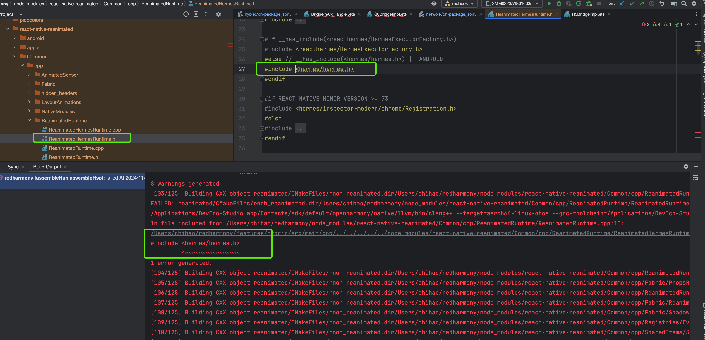

# 编译类FAQ

## RN偶现崩溃，报"Fault thread info，Name:RNOH_BACKGROUND"错误
-错误提示  
```
Process name:xxxxxxxxxx
Process life time:1584s
Reason:Signal:SIGSEGV(SEGV_MAPERR)@xxxxxxxxxxxx
Fault thread info:
Tid:xxxx, Name:RNOH_BACKGROUND
```
-解决  
创建`RNInstance`时将`enableBackgroundExecutor`设置成false。

## 编译时报错，找不到TextLayoutManager 
- 错误提示
编译 CPP 的时候报错，在报错信息中搜索 `error` ，发现是 `TextLayoutManager.cpp` 文件找不到了。截图如下:

- 原因  
该问题是由于工程的路径太长导致的，请缩短工程的路径。

## 找不到generated等文件
- 错误提示  
错误信息的意思是说找不到 `react_native_openharmony/generated/ts` 文件， `react_native_openharmony/generated` 里面的文件是由 Codegen生成。
- 错误截图  

- 原因
1. 未执行 Codegen；
2. Codegen 生成的文件未能放到正确的位置。
- 解决:  
方案1：
    Codegen 会根据接口声明自动生成 cpp 和 ets 代码，生成代码的位置可通过 `--cpp-output-path`、 `--rnoh-module-path` 两个参数调整，这两个参数具体的值可通过对比 **RN** 工程与 OpenHarmony 工程的相对路径得出。  
方案2：
    先任意指定一下 `--cpp-output-path` 、 `--rnoh-module-path` 两个参数的值，然后将生成的 generated 文件夹分别复制到 OpenHarmony 工程中（如： ets 复制到 `entry/oh_modules/react_native_openharmony` 中， cpp 复制到 `entry/src/main/cpp` 中）

## 打包时或启动Metro时报错，找不到DrawerLayoutAndroid
- 错误截图  
当打包或者运行 Metro 服务的时候，报 `None of these files exist` ，报错截图如下：

- 原因  
该问题是没有配置 OpenHarmony 打包参数导致的，请参考[如何配置OpenHarmony打包参数](../常见开发场景.md#如何配置openharmony打包参数)，配置完成后重新打包。

## 找不到HiTrace编译选项
- 错误截图  

- 原因  
该问题是编译选项中没有设置 `WITH_HITRACE_SYSTRACE` 为 1 导致的，您可以在 CMakeLists 中添加该编译选项，需要注意的是，设置 `WITH_HITRACE_SYSTRACE` 编译选项需要写在 `add_subdirectory()` 之前，否则将不会生效：

    ```CMAKE
    # CMakeLists.txt
    ···
    set(WITH_HITRACE_SYSTRACE 1)
    add_compile_definitions(WITH_HITRACE_SYSTRACE)

    add_subdirectory(...)
    ···
    ```

## react-native不是内部或外部命令
- 解决  
  
该问题为 `npm install` 的时候存在问题，请确认 `package.json` 的正确性，并重新执行以下命令：

    ```PowerShell
    npm install
    ```

## MAC环境下Cannot find module ‘@react-native/babel-preset’
- 错误截图  

 - 原因  
该问题是从编辑器复制创建工程命令的时候，添加了多余的符号导致的。
- 解决  
您可以将复制的命令格式化之后再执行，或者手动输入创建工程的命令。

## 找不到libhermes.so
 
该问题可能会分为以下三种表现情况：
 
1. Hilog 日志提示，libhermes.so 没有找到，can't find library libhermes.so in namespace: moduleNs_default。
 
   
 
2. native 工程 `\entry\build\default\outputs\default\entry-default-signed.hap` 包中查找，没有发现 libhermes.so。
 
3. DevEco Studio 上有一个特性，[需要开发者修改适配](https://developer.huawei.com/consumer/cn/doc/harmonyos-releases-V5/ide-changelogs-db5-V5)，举例说明该特性：如果存在2个 har 包，且 har 包 A 的 so 依赖了 har 包 B 的 so。在之前的版本中，har 包 A 在打包过程中会将 har 包 B 的 so 打包到 har 包 A 里，在当前版本中，har 包 A 打包时将不会携带 har 包 B 的 so。
 
该问题的解决方法：
 
需要在 har 模块 `/build-profile.json5` 中增加：

```json5
"nativeLib": {  // 与externalNativeOptions字段同级别
  "excludeFromHar": false
}
```
 


## RNOH_CAPI_ARCH环境变量相关

- 现象

    **RNOH** 编译报错，提示：CustomComponentArkUINodeHandleFactory.h:62:12: error: no viable conversion from returned value of type 'std::nullptr_t' to function return type 'std::pair<ArkUI_NodeHandle, napi_ref>' (aka 'pair<ArkUI_Node *, napi_ref__ *>')。

- 原因

    `RNOH_CAPI_ARCH` 环境变量引起。

- 解决

    1. 此报错是 **CAPI** 版本的错误，需要您在环境变量中设置 `RNOH_C_API_ARCH=1`，重启 DevEco Studio，并运行 **Build > Clean Project**，重新编译后即可解决。
    2. 如果上述设置不生效，可以请删除 `.cxx` 目录，重新编译运行。
    3. 如果上述操作还不生效，可以在您自己的 `CMakeLists.txt` 中设置：

    ```CMAKE
    set(RNOH_C_API_ARCH, 1)
    ```

## Release版本C++编译问题

- 背景

    目前 **RNOH** 外发的配套版本都有两套编译 har 包和 `CMakeLists.txt` 文件，一套是 debug 版本，一套是 release 版本（具体会带上-release后缀），区别： 

    - 大小 release 将 C++ 源码转换成了动态库 `so` 文件，减少了包大小。
    - 构建速度：由于做了预编译，引用 release 版本的 har 包，主应用的构建速度会明显加快。
    - 调试：release 版本去除了调试功能，因此想用 **JS** 断点调试的话建议先使用 debug 版本。

- 现象

    使用 `CMakeLists - release.txt` 替换成 `CMakeLists.txt` 之后，出现了一些编译错误。
    - 错误1：Undefined Identifier相关。
    - 错误2：undefined symbol: folly
        -   ld.lld: error: undefined symbol: folly::f14::detail::kEmptyTagVector
            ld.lld: error: undefined symbol: folly::f14::detail::F14LinkCheck<(folly::f14::detail::F14IntrinsicsMode)1>::check()

- 原因

    - 错误1：一般是因为 `CMakeLists.txt` 中没有 include 对应三方库的头文件路径。
    - 错误2：目前很多三方库的开发都会引入 `folly` 的头文件，所以三方库的包编译需要加上 `folly` 的相关配置，否则就会出现未定义符号的问题。

- 解决

    - 错误1：根据提示，在 `include_directories` 选项中补充对应三方库的头文件路径。
    - 错误2：三方包得加上 `folly` 编译配置，如 `target_compile_options` (三方库包名 PUBLIC${folly_compile_options})。

## hvigor ERROR：Exceptions happend while excuting：ninja：Entering directory...

- 现象
	
    **RNOH** 编译失败，提示如下：
    

- 原因

    看蓝色提示：`is the command line too long?` 说明可能cmd命令执行超长了，导致无法执行 ninja 编译命令。（PS：目前 windows 下 cmd 命令最长为 8191 个字符）

- 解决

    native 工程根目录太深或者工程名称过长，建议将 native 工程目录级别缩短或者尝试将工程命名缩短。

## hvigor ERROR: Failed :entry:default@HotReloadArkTS...

- 现象
	
    使用 5.0.0.500 release 版本 RNOH.har 编译构建时，报错，具体如下：
    ```PowerShell
    > hvigor ERROR: Failed :entry:default@HotReloadArkTS...
    > hvigor ERROR: ArkTS:ERROR File: /Users/aigcheng/work/codespace/app-harmony/huazhuhui/oh_modules/.ohpm/@rnoh+react-native-openharmony@pr5doejn6e1pdvw0glvewknk+eemfkhfs1ilfycgfmw=/oh_modules/@rnoh/react-native-openharmony/src/main/ets/RNOH/RNAbility.ets:112:35
    Argument of type '{ logger: RNOHLogger; }' is not assignable to parameter of type '{ baseRequestOptions?: RequestOptions; responseInterceptors?: ResponseInterceptor[]; requestInterceptors?: RequestInterceptor[]; }'.
    Object literal may only specify known properties, and 'logger' does not exist in type '{ baseRequestOptions?: RequestOptions; responseInterceptors?: ResponseInterceptor[]; requestInterceptors?: RequestInterceptor[]; }'.

    > hvigor ERROR: BUILD FAILED in 36 s 337 ms

    发现是@rnoh\react-native-openharmony\src\main\ets\RNOH\RNAbility.ets文件的：
    return new DefaultHttpClient({logger: this.logger}); 这行代码，应该修改为return new DefaultHttpClient();
    ```
- 原因

    是源码中 HttpClient.ts 的构造函数中缺少 logger 参数，release 包解析出来的源码是带 logger 参数。

- 解决

    删除项目中的 `oh_modules` 文件夹，点击同步重新加载。

## ERROR: missing: @rnoh/react-native-openharmony@D:\SampleRN\AwesomeApp\oh_modules\.ohpm\@react-native-oh-tpl+react-native-linear-gradient@boyzfjkz+1u0h9qytn7nrfzxgndfqxrq3gwpaleooou=\oh_modules\@react-native-oh-tpl\react_native_openharmony, required by @react-native-oh-tpl/react-native-linear-gradient@D:\SampleRN\AwesomeApp\libs\linear_gradient.har

- 现象

  在引入RN三方库，或自定义TurboModule/组件的场景下，点击 `flie ---> sync and refresh project` 后报错:

  

- 原因

  三方库中需要引入rnoh的依赖。

- 解决

  在工程级oh-package.json5文件下加上以下依赖：

  ```json5
  {
    ...
    "overrides":{
      "@rnoh/react-native-openharmony":"^X.X.X"
    }
  }
  ```

## release模式，缺失folly编译报错
- 现象  
缺失folly，release模式编译报错。

```bash
CMake Error at CMakeLists.txt:168 (target_link_libraries):
Attempt to add link library "-DFOLLY_NO_CONFIG=1" to target
"xxx" which is not built in this directory.
This is allowed only when policy CMP0079 is set to NEW.

-- Configuring incomplete, errors occurred!
```

- 解决  

将folly添加到编译构建，在`CMakeLists.txt`中导入缺失的folly。  
```CMAKE
target_link_libraries(xxx PUBLIC ${folly_compile_options})
```

## Release版本编译报找不到<hermes/hermes.h>头文件

- 现象

    

- 原因

    这类错误一般是在使用RN三方库时引入。`hermes/hermes.h` 是裁剪过的路径，编译器根据配置的头文件目录无法找到该文件，因此会编译报错。

- 解决

    在Release版本的RNOH中，头文件已全部抽取出来并放到了 `src/main/include` 文件夹下，如果遇到上述错误，可到 `include` 文件夹下找到对应的文件，并将其路径配置在 `CMakeLists.txt` 的 **include_directories** 里面。例如，对于上述问题，修复方案是：
    ```diff
    # 添加头文件目录
    include_directories(${NATIVERENDER_ROOT_PATH}
                        ${RNOH_CPP_DIR}
                        ...
    +                   ${RNOH_CPP_DIR}/third-party/hermes/API
                        )
    ```

## OpenHarmony设备运行跑RN工程，加载librawfile.so失败
- 原因
`librawfile.z.so`目录放在`system/lib64`下面，在ohos上加了沙箱管控没有挂载这个目录，只挂载了`system/lib64/ndk`。
- 解决  
    1. 挂载磁盘
        ```shell
        hdc target mount
        ```
    2. 修改沙箱文件
        在`system/ets/sandbox/appdata-sandbox.json`中搜索`/system/lib`关键字，在关键位置加上`/system/lib64`。
        ```json
        {
            "src-path":"/system/lib64",
            "sandbox-path":"/system/lib64",
            "sandbox-flags":[
                "bind",
                "rec"
            ],
            "check-action-status":"false"
        }
        ```

## RN前端工程编译打包时提示错误信息："error: unknown command 'codegen-lib-harmony' 或 'error: unknown command 'bundle-harmony'"
- 错误提示
```
 error: unknown command 'codegen-lib-harmony'
 或者
 error: unknown command 'bundle-harmony'
```

- 原因
社区metro库版本更新及memfs库版本更新导致不兼容

- 解决
在前端工程目录中的package.json文件新增下面两个依赖，然后执行npm i命令，再重新编译即可。
```
"dependencies": {
  ...
  "metro": "0.82.5",
  "memfs": "4.17.2"
}
```