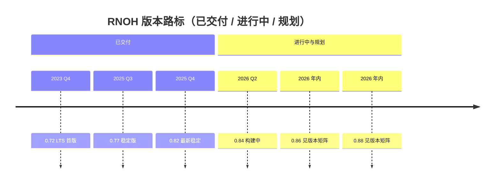

### RNOH 社区版路线图（2026年）

> 本文档为社区版本路线图，具体内容与时间节点可能根据上游社区和实际进展进行调整，最终以社区公告为准。

### 背景说明

RNOH（React Native OpenHarmony）社区版本旨在鸿蒙设备上提供与 React Native 上游社区尽可能一致的开发体验与 API 能力。  
为保障生态一致性和长期维护成本可控，RNOH 需要：

- **对齐上游版本节奏**：在合理的节奏下跟进上游的主要 Release。
- **聚焦关键版本**：优先适配对业务与生态影响最大的几个版本，而不是“全版本覆盖”。
- **平衡稳定与创新**：在保证现有业务稳定性的前提下，引入上游的特性更新和性能优化。

2026 年上游社区规划约 6 个 release 版本，RNOH 社区计划聚焦适配其中 4 个版本，通过季度节奏逐步推进。

---

### 版本规划概述

2026 年上游预计规划 6 个 release 版本，RNOH 计划在 2026 年内适配其中 4 个版本：

- **Q1**：完成并发布 `0.82.x` 的适配版本（进行中）
- **Q2**：发布 `0.84.x` 的适配版本
- **Q3**：发布 `0.86.x` 的适配版本
- **Q4**：发布 `0.88.x` 的适配版本

具体时间与内容以社区后续公告为准。

---

### 版本演进路标图

### 版本支持矩阵

| 版本     | 上游分支截止时间   | 上游发布时间     | RNOH 支持策略 | RNOH 首次发布时间 | RNOH 预计支持时间 |
| ------ | ---------- | ---------- | --------- | ----------- | ----------- |
| 0.89.x | 2026-11-03 | 2026-12-07 | NA        | -           | -           |
| 0.88.x | 2026-09-07 | 2026-10-12 | 适配        | -           | 2026 Q4     |
| 0.87.x | 2026-07-06 | 2026-08-10 | NA        | -           | -           |
| 0.86.x | 2026-05-04 | 2026-06-08 | 适配        | -           | 2026 Q3     |
| 0.85.x | 2026-03-02 | 2026-04-06 | NA        | -           | -           |
| 0.84.x | 2026-01-05 | 2026-02-09 | 适配        | -           | 2026 Q2     |
| 0.83.x | 2025-11-03 | 2025-12-08 | NA        | -           | -           |
| 0.82.x | 2025-09-01 | 2025-10-06 | 适配中       | 2026 Q1   | -           |
| 0.77.x | 2024-09-01 | 2025-01-21 | 适配        | 2025 Q3   | -           |
| 0.72.x | 2023-05-01 | 2023-06-21 | 适配        | 2023 Q4   | -           |

---

### 版本特征

> 0.84.x

- *[Hermes V1 as Default](https://reactnative.dev/blog/2026/02/11/react-native-0.84#hermes-v1-as-default)*
Hermes V1 现已成为 React Native 上的默认 JavaScript 引擎，Hermes V1 代表了 Hermes 引擎的下一个进化，对编译器和虚拟机都有重大改进，带来了显著提升的 JavaScript 性能。
- *[Precompiled Binaries on iOS by Default](https://reactnative.dev/blog/2026/02/11/react-native-0.84#precompiled-binaries-on-ios-by-default)*
React Native 0.84 现在默认在 iOS 上预编译的二进制文件。此前作为选择加入引入的预编译二进制文件现在开箱即用，显著缩短了iOS应用的构建时间。
- *[Legacy Architecture Components Removed](https://reactnative.dev/blog/2026/02/11/react-native-0.84#legacy-architecture-components-removed)*
React Native 0.84 继续从 iOS 和 Android 中移除遗留架构代码。正如RFC中所述，我们在每个版本中都会移除几个遗留架构类。
- *[Node.js 22 Minimum](https://reactnative.dev/blog/2026/02/11/react-native-0.84#nodejs-22-minimum)*
 React Native 0.84 需要 v22.11 或更高版本Node.js。这一提升提升了现代JavaScript功能在React Native工具生态系统中的可用性。

> 0.82.x

- *[New Architecture Only](https://reactnative.dev/blog/2025/10/08/react-native-0.82#new-architecture-only)*
新架构成为React Native的唯一架构
- *[Experimental Hermes V1](https://reactnative.dev/blog/2025/10/08/react-native-0.82#experimental-hermes-v1)*
Hermes V1 是 Hermes 的下一代进化版。我们一直在我们的应用程序内部进行试验，现在社区也应该尝试一下。它对编译器和虚拟机进行了改进，从而提高了 Hermes 的性能
- *[React 19.1.1](https://reactnative.dev/blog/2025/10/08/react-native-0.82#react-1911)*
React 19.1.1 还提高了 React Native Suspense 边界中 [useDeferredValue](https://react.dev/reference/react/useDeferredValue) 和 [startTransition](https://react.dev/reference/react/startTransition) 的可靠性。这些是重要的 React 功能，旨在提高应用程序的响应速度。此前，当与 React Native 上的 Suspense 边界一起使用时，两者都会错误地显示后备组件。在 React 19.1.1 中，它们现在在 React Native 上始终按照预期执行，使它们的行为与 Web 保持一致
- *[DOM Node API](https://reactnative.dev/blog/2025/10/08/react-native-0.82#dom-node-apis)*  
从 React Native 0.82 开始，原生组件将通过 refs 提供类似 DOM 的节点

>  0.77.x

- [New CSS Features for better layouts, sizing and blending](https://reactnative.dev/blog/2025/01/21/version-0.77#new-css-features-for-better-layouts-sizing-and-blending)
新CSS特性，优化布局、尺寸和混合

- [Android version 15 support & 16KB page support](https://reactnative.dev/blog/2025/01/21/version-0.77#android-version-15-support--16kb-page-support)
Android版本15支持 & 16KB页面支持

- [Community CLI and Template Updates](https://reactnative.dev/blog/2025/01/21/version-0.77#community-cli-and-template-updates)
CLI 和模版更新

> 0.72.x

- [New Metro Features](https://reactnative.dev/blog/2023/06/21/0.72-metro-package-exports-symlinks#new-metro-features)
新的Metro特性

- [Developer Experience Improvements](https://reactnative.dev/blog/2023/06/21/0.72-metro-package-exports-symlinks#developer-experience-improvements)
开发者体验改进

- [Moving New Architecture Updates](https://reactnative.dev/blog/2023/06/21/0.72-metro-package-exports-symlinks#moving-new-architecture-updates)
移动新架构更新

### RNOH能力增强

当前RNOH已规划的能力增强包括但不限于：

- **核心框架能力**
  - 与上游 React Native 相兼容的核心模块（View、Text、Image、ScrollView 等）。
  - JavaScript/TypeScript 运行时与基础桥接能力的对齐。
- **性能与稳定性**
  - 启动速度、内存占用、渲染性能等关键指标的基线测量与优化，持续优化框架性能。
  - 针对典型业务场景的压力测试和长期运行稳定性验证。
- **问题定位（DFX）能力**
  - 支持CPPCrash场景下获取JS业务栈（Hermes）。
  - 支持冻屏场景下获取JS业务栈。
  - 支持导出JSVM内存快照，方便分析RN内存问题。
- **多设备开发能力**
  - 支持RN框架接入平行视界功能。
  - 提供安全区域布局组件，支持以安全区方式实现避让和沉浸效果。

不同版本的具体适配范围会在相应版本的详细 Release Note 中进一步细化。

---

### 近期重点里程碑

- **0.82.x（Q1）**
  - **状态**：适配中  
  - **目标**：完成对上游 0.82.x 的基础能力对齐与核心功能验证，为后续版本适配打好基础。
- **0.84.x（Q2）**
  - **状态**：方案分析中  
  - **目标**：完成对上游 0.84.x 的功能适配和关键场景验证，计划在 Q2 内发布社区版本。
- **0.86.x（Q3）**
  - **状态**：规划中  
  - **目标**：跟进上游 0.86.x 的新特性和变更，保证与 HarmonyOS 生态的兼容性与性能表现。
- **0.88.x（Q4）**
  - **状态**：规划中  
  - **目标**：对齐上游 0.88.x，完成全年第四个适配版本，确保 RNOH 社区版本在 2026 年保持与上游的同步状态。

---

### 风险与依赖

#### 关键风险

- **上游版本节奏变化**
  - 上游 React Native 可能调整版本规划或引入较大变更，导致现有路线图需要同步调整。
- **资源与人力投入不确定**
  - 核心维护者与贡献者人力波动，可能影响部分版本的适配深度和发布时间。
- **平台特性差异**
  - OpenHarmony 与上游默认平台（Android/iOS）在系统能力、权限模型、UI 渲染机制等方面存在差异，可能导致：
    - 部分特性无法完全对齐。
    - 个别第三方库需要额外适配或功能降级。
- **生态库兼容性**
  - 社区常用三方库更新较快，版本组合复杂，可能出现：
    - 某些库尚未支持当前 React Native 目标版本。
    - 某些库未对 OpenHarmony 进行适配或测试。

---

### 说明与后续调整

- 上述路线图为**初步规划**，后续可能会根据上游发布节奏、社区需求和资源投入情况进行**动态调整**。  
- **最终版本计划、具体里程碑和变更内容以 RNOH 社区后续公告为准。**
