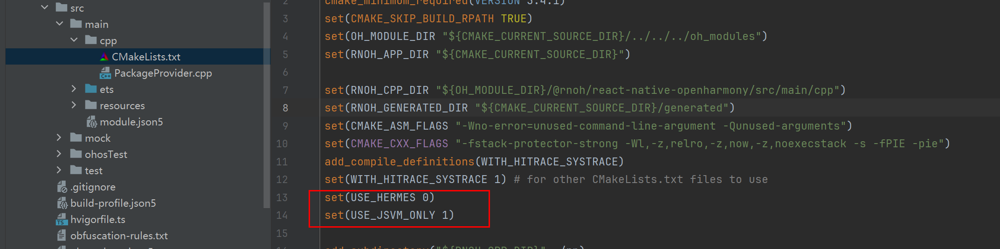
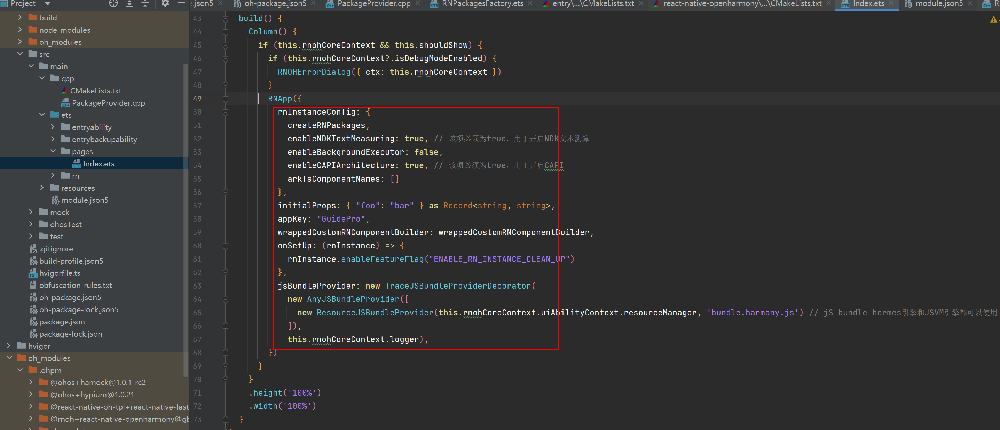
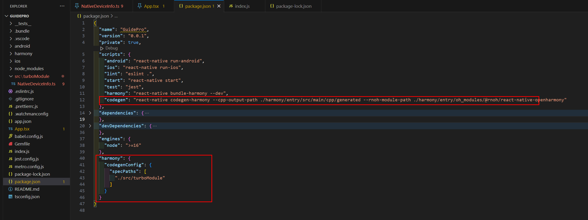

# RN应用鸿蒙化开发指南

## 概述

本文档专注于RN应用鸿蒙化适配改造，针对准备新使用RN技术构建应用，或已有RN应用新增适配鸿蒙端。文档以开发者视角，以鸿蒙化适配完整链路过锚点，逐一剖析RN应用鸿蒙化适配的改造点，旨在帮助开发者对鸿蒙化适配有一个整体的了解。

RN原始社区信息：[https://reactnative.dev/home](https://reactnative.dev/home)

鸿蒙RN社区信息：[https://gitcode.com/openharmony-sig/ohos\_react\_native](https://gitcode.com/openharmony-sig/ohos_react_native)

RN三方库鸿蒙化信息：[https://gitee.com/react-native-oh-library/usage-docs](https://gitee.com/react-native-oh-library/usage-docs)

业界根据bundle的集成模式将开发RN App主要分为集成模式和分离模式，可参考：[React Native ](https://docs.taro.zone/docs/react-native/)[端开发流程 ](https://docs.taro.zone/docs/react-native/)[| Taro ](https://docs.taro.zone/docs/react-native/)[文档](https://docs.taro.zone/docs/react-native/)。

集成模式：JS工程与壳工程在一个工程中，编译打包时候一起编译打包出一个应用包

分离模式：JS工程与壳工程分别在两个工程中，JS编译出bundle后，再将bundle集成到壳工程中，再编译整个应用包。

本文档以分离模式举例讲解鸿蒙RN工程构建，这种方式的主要流程图如下：


## React-Native工程创建

RN项目的开发主要分为原生端工程开发和JS侧工程开发。原生工程开发的开发环境跟纯原生应用开发一致，具体可参考  [Android/iOS环境搭建](https://reactnative.dev/docs/set-up-your-environment)和[鸿蒙环境搭建](https://gitcode.com/openharmony-sig/ohos_react_native/blob/master/docs/zh-cn/%E7%8E%AF%E5%A2%83%E6%90%AD%E5%BB%BA.md)。JS工程开发的开发环境跟大部分前端项目类似，安装NodeJS进行包管理等；安装VSCode进行代码开发。本章主要讲解如何从零开始搭建一个鸿蒙RN工程。一个完整得工程包含了RNJS工程和与之对应得Native原生工程，RNJS工程最后会编译出bundle包，Native工程通过加载并运行bundle，最终呈现出页面。接下来分别介绍如何创建RNJS工程和鸿蒙Native工程，也可以参考[RN开发环境搭建](https://gitcode.com/openharmony-sig/ohos_react_native/blob/master/docs/zh-cn/%E7%8E%AF%E5%A2%83%E6%90%AD%E5%BB%BA.md)。。

-   **[创建RNJS新项目](#创建rnjs新项目)**

-   **[鸿蒙依赖包安装](#鸿蒙依赖包安装)**

-   **[RNJS工程生成bundle](#rnjs工程生成bundle)**

-   **[JS侧工程组织实践](#js侧工程组织实践)**

-   **[JS侧工程工具](#js侧工程工具)**

### 创建RNJS新项目

可选择一个目录，使用 React Native 内置的命令行工具来创建一个名为GuidePro 的新项目（项目名字可以自己定义）。这个命令行工具不需要安装，可以直接用 node 自带的 npx 命令来创建，目前 React Native for OpenHarmony 仅支持 0.72.5 版本的 React Native：

```
npx react-native@0.72.5 init GuidePro --version 0.72.5
```


该命令在 mac 环境下初始化 React Native 项目时会下载 iOS 依赖库，耗时较长，开发者可以选择执行以下命令跳过该过程，后续根据需要自行下载，不影响鸿蒙项目开发：

```
npx react-native@0.72.5 init GuidePro --version 0.72.5 --skip-install
```

上面的操作将得到一个基本的RNJS工程，这就是一个传统的android和ios对应的RN工程，在android和ios目录中存放了其对应native工程，为了扩展使其支持鸿蒙工程，在根目录下新建一个harmony目录用于存放鸿蒙native工程，然后可以得到如下文件：


### 鸿蒙依赖包安装

1. 打开 GuidePro 目录下的 package.json，在 scripts 下新增 OpenHarmony 的依赖：

```
{  
"name": "AwesomeProject",  
"version": "0.0.1",  
"private": true,  
"scripts": {  
   "android": "react-native run-android",  
   "ios": "react-native run-ios",  
   "lint": "eslint .",  
   "start": "react-native start",  
   "test": "jest", 
+  "harmony": "react-native bundle-harmony --dev"  
   },  
"dependencies": {  
   "react": "18.2.0",  
   "react-native": "0.72.5"  
   },  
"devDependencies": {  
   "@babel/core": "^7.20.0",  
   "@babel/preset-env": "^7.20.0",  
   "@babel/runtime": "^7.20.0",  
   "@react-native/eslint-config": "^0.72.2",  
   "@react-native/metro-config": "^0.72.11",  
   "@tsconfig/react-native": "^3.0.0",  
   "@types/react": "^18.0.24",  
   "@types/react-test-renderer": "^18.0.0",  
   "babel-jest": "^29.2.1",  "eslint": "^8.19.0",  
   "jest": "^29.2.1",  
   "metro-react-native-babel-preset": "0.76.8",  
   "prettier": "^2.4.1",  
   "react-test-renderer": "18.2.0",  
   "typescript": "4.8.4"  
   },  
   "engines": {  
      "node": ">=16"  
   } 
}
```

2. 在 GuidePro 目录下运行安装依赖包命令：

通过下面命令可以下载鸿蒙版本RN依赖包,此命令会在package.json文件中

```
npm i @react-native-oh/react-native-harmony@x.x.x
```


> **说明：** 
>1.  指令中@x.x.x用于指定下载的版本，不指定时默认下载最新版本。
>2.  本地安装鸿蒙化依赖,请参考[如何使用本地安装鸿蒙化依赖](https://gitcode.com/openharmony-sig/ohos_react_native/blob/master/docs/zh-cn/%E7%89%88%E6%9C%AC%E5%8D%87%E7%BA%A7%E6%8C%87%E5%AF%BC.md/#%E5%A6%82%E4%BD%95%E4%BD%BF%E7%94%A8%E6%9C%AC%E5%9C%B0%E5%AE%89%E8%A3%85%E9%B8%BF%E8%92%99%E5%8C%96%E4%BE%9D%E8%B5%96)。
>3.  如何从本地依赖切换至远程依赖,请参考[如何从本地依赖切换至远程依赖](https://gitcode.com/openharmony-sig/ohos_react_native/blob/master/docs/zh-cn/%E7%89%88%E6%9C%AC%E5%8D%87%E7%BA%A7%E6%8C%87%E5%AF%BC.md/#%E5%A6%82%E4%BD%95%E4%BB%8E%E6%9C%AC%E5%9C%B0%E4%BE%9D%E8%B5%96%E5%88%87%E6%8D%A2%E8%87%B3%E8%BF%9C%E7%A8%8B%E4%BE%9D%E8%B5%96)。

### RNJS工程生成bundle

1. 打开 GuidePro\\metro.config.js，并添加 OpenHarmony 的适配代码。配置文件的详细介绍，可以参考[React Native 中文网](https://reactnative.cn/docs/metro)。修改完成后的文件内容如下：

```
const {mergeConfig, getDefaultConfig} = require('@react-native/metro-config'); 
const {createHarmonyMetroConfig} = require('@react-native-oh/react-native-harmony/metro.config');  

/*** @type {import("metro-config").ConfigT}*/ 
const config = {
 transformer: {
   getTransformOptions: async () => ({
     transform: {
       experimentalImportSupport: false,
       inlineRequires: true,
     },
   }),
 },
};  
module.exports = mergeConfig(getDefaultConfig(__dirname), createHarmonyMetroConfig({ reactNativeHarmonyPackageName: '@react-native-oh/react-native-harmony', }), config);
```

2. 在 GuidePro 目录下运行生成 bundle 文件的命令。运行成功后，会在 GuidePro/harmony/entry/src/main/resources/rawfile 目录下生成 bundle.harmony.js 和 assets 文件夹，assets 用来存放图片（如果 bundle 中不涉及本地图片，则没有 assets 文件夹）。

```
npm run harmony
```


> **注意：** 
>如果运行时报错 “'react-native'不是内部或外部命令，也不是可运行的程序或批处理文件。”，请重新运行 npm install 命令。
>如果运行时提示”error: unknown command 'bundle-harmony' “,请确认一下上一步npm i @react-native-oh/react-native-harmony是否执行成功。

3. 您也可以使用 Metro 服务来加载 bundle 包。具体使用方式，可以参考[Metro热加载](https://gitcode.com/openharmony-sig/ohos_react_native/blob/master/docs/zh-cn/%E8%B0%83%E8%AF%95%E8%B0%83%E6%B5%8B.md#metro%E7%83%AD%E5%8A%A0%E8%BD%BD)。

### JS侧工程组织实践

上面的工程会得到一个集成模式的工程，基于这个工程，删掉原生相关目录/文件，仅保留JS相关的目录/文件。由于Demo工程的JS文件比较少，实际开发过程中的JS工程会承载非常多业务，推荐按照下述结构组织整个工程结构：


### JS侧工程工具

建议前端工程接入主流的社区工具，具体配置可以接入社区推荐配置，并根据业务做自定义扩展：

<a name="table6244112414193"></a>

<table><thead align="left"><tr id="row15265224101912"><th class="cellrowborder" valign="top" width="33.333333333333336%" id="mcps1.1.4.1.1"><p id="p426517247196"><a name="p426517247196"></a><a name="p426517247196"></a>序号</p>
</th>
<th class="cellrowborder" valign="top" width="33.333333333333336%" id="mcps1.1.4.1.2"><p id="p102651324141915"><a name="p102651324141915"></a><a name="p102651324141915"></a>类型</p>
</th>
<th class="cellrowborder" valign="top" width="33.333333333333336%" id="mcps1.1.4.1.3"><p id="p526518243198"><a name="p526518243198"></a><a name="p526518243198"></a>名称</p>
</th>
</tr>
</thead>
<tbody><tr id="row7265172413192"><td class="cellrowborder" valign="top" width="33.333333333333336%" headers="mcps1.1.4.1.1 "><p id="p1265172413191"><a name="p1265172413191"></a><a name="p1265172413191"></a>1</p>
</td>
<td class="cellrowborder" valign="top" width="33.333333333333336%" headers="mcps1.1.4.1.2 "><p id="p1126582481916"><a name="p1126582481916"></a><a name="p1126582481916"></a>代码格式化</p>
</td>
<td class="cellrowborder" valign="top" width="33.333333333333336%" headers="mcps1.1.4.1.3 "><p id="p1265112461915"><a name="p1265112461915"></a><a name="p1265112461915"></a>Prettier</p>
</td>
</tr>
<tr id="row1226522413199"><td class="cellrowborder" valign="top" width="33.333333333333336%" headers="mcps1.1.4.1.1 "><p id="p62657241195"><a name="p62657241195"></a><a name="p62657241195"></a>2</p>
</td>
<td class="cellrowborder" valign="top" width="33.333333333333336%" headers="mcps1.1.4.1.2 "><p id="p192651824181919"><a name="p192651824181919"></a><a name="p192651824181919"></a>代码静态检查</p>
</td>
<td class="cellrowborder" valign="top" width="33.333333333333336%" headers="mcps1.1.4.1.3 "><p id="p1926522461918"><a name="p1926522461918"></a><a name="p1926522461918"></a>ESLint</p>
</td>
</tr>
<tr id="row122651324171918"><td class="cellrowborder" valign="top" width="33.333333333333336%" headers="mcps1.1.4.1.1 "><p id="p1326582420197"><a name="p1326582420197"></a><a name="p1326582420197"></a>3</p>
</td>
<td class="cellrowborder" valign="top" width="33.333333333333336%" headers="mcps1.1.4.1.2 "><p id="p1826532411195"><a name="p1826532411195"></a><a name="p1826532411195"></a>类型检查</p>
</td>
<td class="cellrowborder" valign="top" width="33.333333333333336%" headers="mcps1.1.4.1.3 "><p id="p1926572431918"><a name="p1926572431918"></a><a name="p1926572431918"></a>TypeScript</p>
</td>
</tr>
<tr id="row132656244194"><td class="cellrowborder" valign="top" width="33.333333333333336%" headers="mcps1.1.4.1.1 "><p id="p326562413198"><a name="p326562413198"></a><a name="p326562413198"></a>4</p>
</td>
<td class="cellrowborder" valign="top" width="33.333333333333336%" headers="mcps1.1.4.1.2 "><p id="p426515243193"><a name="p426515243193"></a><a name="p426515243193"></a>转译</p>
</td>
<td class="cellrowborder" valign="top" width="33.333333333333336%" headers="mcps1.1.4.1.3 "><p id="p1626516243199"><a name="p1626516243199"></a><a name="p1626516243199"></a>Babel</p>
</td>
</tr>
<tr id="row19266102416195"><td class="cellrowborder" valign="top" width="33.333333333333336%" headers="mcps1.1.4.1.1 "><p id="p14266172411198"><a name="p14266172411198"></a><a name="p14266172411198"></a>5</p>
</td>
<td class="cellrowborder" valign="top" width="33.333333333333336%" headers="mcps1.1.4.1.2 "><p id="p02661424131918"><a name="p02661424131918"></a><a name="p02661424131918"></a>单元测试</p>
</td>
<td class="cellrowborder" valign="top" width="33.333333333333336%" headers="mcps1.1.4.1.3 "><p id="p826602420197"><a name="p826602420197"></a><a name="p826602420197"></a>Jest</p>
</td>
</tr>
</tbody>
</table>

可以将上述相关工程工具作为一个基础设施构建，业务工程直接接入公共能力即可。

## 创建RN鸿蒙壳工程

本章节主要介绍了鸿蒙工程的创建，并加载 React Native 相关的依赖包和 bundle 包，最终完成鸿蒙工程的运行的过程。

-   **[初始化鸿蒙工程](#初始化鸿蒙工程)**

-   **[RN依赖配置](#rn依赖配置)**

-   **[原生工程集成RNOH](#原生工程集成rnoh)**

-   **[Bundle包加载](#bundle包加载)**

-   **[启动并运行工程](#启动并运行工程)**

-   **[release包使用](#release包使用)**

### 初始化鸿蒙工程

下面演示在新建工程中集成。点击 File \> New \> Create Project，选择创建 Empty Ability 工程，点击 Next 按钮，并在 Compile SDK 中选择 API14\(这里按照需要以及RNOH支持的api版本选择\)，创建一个名为 GuidePro \(这个可以自己定义，不一定需要和RNJS同名\)的项目。注意项目路径不要太长.


推荐鸿蒙工程路径选择为上文创建的 harmony 文件夹。若创建 Empty Ability 工程时出现 `The folder "harmony" is not empty` 的提示，需先清空 harmony 文件夹再进行创建，随后重新执行 `npm run harmony` 命令生成 bundle 文件。


完成上述操作后，编译产物会自动导出至 native 工程，如图所示：


连接真机，点击 File \> Project Structure，在弹窗界面点击 Signing Configs，勾选 Support OpenHarmony 和 Automatically generate signature，然后点击 Sign In 登录华为账号，并签名。


### RN依赖配置

为了保证rnoh版本一致,同时方便选择源码或release包导入rnoh的har包，Demo采用npm管理依赖，在entry下新建package.json文件，里面导入react-native-oh包，如下：


通过上述操作可以在node\_module文件夹得到react-native-openharmony.har和react-native-openharmony-release.har,然后通过本地来的方式导入对应har包，这里使用release和非release都可以，release版本可以加快编译速度，非release版本是全量源码编译。


本地导包操作如下,oh-package.json文件中可选择har：


如果工程不需要release版本依赖，使用源码har包，可以简单地在 entry 目录下执行以下命令就可以完成,这里版本号需要和RNJS工程中版本号保持一致，防止因为版本不一致导致兼容性问题：

```
ohpm install @rnoh/react-native-openharmony@x.x.x
```

执行完成后会在工程级目录以及模块级目录下生成 oh\_modules 文件夹，如上图。

> **须知：** 
>1.  指令中@x.x.x用于指定下载的版本，不指定时默认下载最新版本。
>2.  由于 har 包比较大，这一步耗时会比较长，务必保证 ohpm install 和 IDE 自发的 SyncData 全都完成，否则会导致编译报错。
>3.  如何在三方库或自定义module中引入rnoh的依赖，请参考[文档](https://gitcode.com/openharmony-sig/ohos_react_native/blob/master/docs/zh-cn/%E5%B8%B8%E8%A7%81%E5%BC%80%E5%8F%91%E5%9C%BA%E6%99%AF.md/#%E5%A6%82%E4%BD%95%E5%9C%A8%E4%B8%89%E6%96%B9%E5%BA%93%E6%88%96%E8%87%AA%E5%AE%9A%E4%B9%89module%E4%B8%AD%E5%BC%95%E5%85%A5rnoh%E7%9A%84%E4%BE%9D%E8%B5%96)。

### 原生工程集成RNOH

-   **[补充CPP侧代码](#补充cpp侧代码)**

-   **[补充ArkTS侧的代码](#补充arkts侧的代码)**

#### 补充CPP侧代码

1.  在 GuidePro/entry/src/main 目录下新建 cpp 文件夹。
2.  在 cpp 目录下新增CMakeLists.txt，并将RNOH的适配层代码添加到CmakeLists.txt编译构建文件中，最终在编译中可以生成librnop\_app.so文件

```
project(rnapp)
cmake_minimum_required(VERSION 3.4.1) 
set(CMAKE_SKIP_BUILD_RPATH TRUE) 
set(OH_MODULE_DIR "${CMAKE_CURRENT_SOURCE_DIR}/../../../oh_modules") 
set(RNOH_APP_DIR "${CMAKE_CURRENT_SOURCE_DIR}")
  
set(RNOH_CPP_DIR "${OH_MODULE_DIR}/@rnoh/react-native-openharmony/src/main/cpp") 
set(RNOH_GENERATED_DIR "${CMAKE_CURRENT_SOURCE_DIR}/generated") 
set(CMAKE_ASM_FLAGS "-Wno-error=unused-command-line-argument -Qunused-arguments") 
set(CMAKE_CXX_FLAGS "-fstack-protector-strong -Wl,-z,relro,-z,now,-z,noexecstack -s -fPIE -pie") 
add_compile_definitions(WITH_HITRACE_SYSTRACE) 
set(WITH_HITRACE_SYSTRACE 1) # for other CMakeLists.txt files to use
  
add_subdirectory("${RNOH_CPP_DIR}" ./rn)
  
add_library(rnoh_app SHARED
   "./PackageProvider.cpp"
   "${RNOH_CPP_DIR}/RNOHAppNapiBridge.cpp"
 )  

target_link_libraries(rnoh_app PUBLIC rnoh)
```

3. 在 cpp 目录下新增PackageProvider.cpp该文件需要满足以下要求：

-   需要导入 RNOH/PackageProvider；
-   实现 getPackages 方法，用于创建三方库或自定义 TurboModule 或 Fabric 的 package 对象。

> **注意：** 
>此处不涉及三方库与自定义 TurboModule 或组件，需要返回空数组。

```
#include "RNOH/PackageProvider.h"  
using namespace rnoh;  
std::vector<std::shared_ptr<Package>> 
PackageProvider::getPackages(Package::Context ctx) {
   return {};
}
```

4. 打开GuidePro\\entry\\build-profile.json5，将 cpp 中的代码添加到鸿蒙的编译构建任务中，详细介绍可以参考[模块级build-profile.json5](https://developer.huawei.com/consumer/cn/doc/harmonyos-guides-V5/ide-hvigor-build-profile-V5)

```
{
  "apiType": "stageMode",
  "buildOption": {
 +   "externalNativeOptions": {
 +      "path": "./src/main/cpp/CMakeLists.txt",
 +      "arguments": "",
 +      "cppFlags": "",
 +    }
  },
  "buildOptionSet": [
  {
    "name": "release",
    "arkOptions": {
      "obfuscation": {
        "ruleOptions": {
          "enable": true,
          "files": [
            "./obfuscation-rules.txt"
          ]
        }
      }
    }
  },
  ],
  "targets": [
  {
    "name": "default"
  },
  {
    "name": "ohosTest",
  }
  ]
}
```

#### 补充ArkTS侧的代码

1. 打开GuidePro\\entry\\src\\main\\ets\\entryability\\EntryAbility.ets引入并使用RNAbility，该文件需要满足以下的要求：

-   如果需要扩展使用对应的生命周期函数，请在代码中使用 super，RNAbility 在生命周期函数中进行了对应的操作，需要使用 super 保证功能不丢失；
-   需要重写 getPagePath，返回程序的入口 page。


2. 在GuidePro\\entry\\src\\main\\ets\\rn目录下新增RNPackagesFactory.ets，该文件需要满足以下要求：

-   在 @rnoh/react-native-openharmony 导入 RNPackageContext 和 RNPackage；
-   在文件中导出 createRNPackages 方法，用于创建三方库或自定义 TurboModule、Fabric的package 对象。

> **注意：** 
>此处不涉及三方库与自定义TurboModule或组件，需要返回空数组。

```
import { RNPackageContext, RNPackage } from '@rnoh/react-native-openharmony/ts';
export function createRNPackages(ctx: RNPackageContext): RNPackage[] {
 return [];
}
```

> **注意：** 
>RNApp的参数appKey需要与RN工程中AppRegistry.registerComponent注册的appName保持一致，否则会导致白屏。

```
import {
 AnyJSBundleProvider,
 ComponentBuilderContext,
 FileJSBundleProvider,
 MetroJSBundleProvider,
 ResourceJSBundleProvider,
 RNApp,
 RNOHErrorDialog,
 RNOHLogger,
 TraceJSBundleProviderDecorator,
 RNOHCoreContext } from '@rnoh/react-native-openharmony';
 import { createRNPackages } from '../rn/RNPackagesFactory';

@Builder export function buildCustomRNComponent(ctx: ComponentBuilderContext) {}

const wrappedCustomRNComponentBuilder = wrapBuilder(buildCustomRNComponent)

@Entry @Component struct Index {
   @StorageLink('RNOHCoreContext') private rnohCoreContext: RNOHCoreContext | undefined = undefined
   @State shouldShow: boolean = false
   private logger!: RNOHLogger

   aboutToAppear() {
     this.logger = this.rnohCoreContext!.logger.clone("Index")
     const stopTracing = this.logger.clone("aboutToAppear").startTracing();
     this.shouldShow = true
     stopTracing();
   }

    onBackPress(): boolean | undefined {
     // NOTE: this is required since `Ability`'s `onBackPressed` function always
     // terminates or puts the app in the background, but we want Ark to ignore it completely
     // when handled by RN
     this.rnohCoreContext!.dispatchBackPress()
     return true
   }   
 
    build() {
     Column() {
     if (this.rnohCoreContext && this.shouldShow) {
       if (this.rnohCoreContext?.isDebugModeEnabled) {
         RNOHErrorDialog({ ctx: this.rnohCoreContext })
       }
       RNApp({
         rnInstanceConfig: {
           createRNPackages,
           enableNDKTextMeasuring: true, // 该项必须为true，用于开启NDK文本测算
           enableBackgroundExecutor: false,
           enableCAPIArchitecture: true, // 该项必须为true，用于开启CAPI
           arkTsComponentNames: []
         },
         initialProps: {  } as Record<string, string>, // 传参
         appKey: "AwesomeProject",
         wrappedCustomRNComponentBuilder: wrappedCustomRNComponentBuilder,
         onSetUp: (rnInstance) => {
           rnInstance.enableFeatureFlag("ENABLE_RN_INSTANCE_CLEAN_UP")
         },
         jsBundleProvider: new TraceJSBundleProviderDecorator(
           new AnyJSBundleProvider([
             new ResourceJSBundleProvider(this.rnohCoreContext.uiAbilityContext.resourceManager, 'bundle.harmony.js') // jS bundle hermes引擎和JSVM引擎都可以使用          ]),
           this.rnohCoreContext.logger),
       })
     }
   }
   .height('100%')
   .width('100%')
 }
}
```

### Bundle包加载

在上一章节中已经完成了 bundle 文件的生成，接下来将它加载到 DevEco Studio 中以运行 GuidePro 项目。加载 bundle 有三种方式：

-   方式一：本地加载 bundle。将 bundle 文件和 assets 图片放在 entry/src/main/resources/rawfile 路径下，在 entry/src/main/ets/pages/Index.ets 中使用,下面对应的分别是Hermes引擎的字节码和jsvm的bundle（Hermes引擎也可以运行bundle.harmony.js，但是性能不如bundle.harmony.hbc）。

```
// hermes引擎字节码，文件存放在resource路径下 
new ResourceJSBundleProvider(this.rnohCoreContext.uiAbilityContext.resourceManager, 'hermes_bundle.hbc')  
// jS bundle hermes引擎和JSVM引擎都可以使用 
new ResourceJSBundleProvider(this.rnohCoreContext.uiAbilityContext.resourceManager, 'bundle.harmony.js')
```

-   方式二：使用 Metro 服务加载 bundle。详细流程参考[Metro热加载](https://gitcode.com/openharmony-sig/ohos_react_native/blob/master/docs/zh-cn/%E8%B0%83%E8%AF%95%E8%B0%83%E6%B5%8B.md#metro%E7%83%AD%E5%8A%A0%E8%BD%BD)。

```
new MetroJSBundleProvider()
```

方式三：加载沙箱目录的bundle：

-   [应用沙箱](https://gitcode.com/openharmony/docs/blob/master/zh-cn/application-dev/file-management/app-sandbox-directory.md)是一种以安全防护为目的的隔离机制，避免数据受到恶意路径穿越访问。在这种沙箱的保护机制下，应用可见的目录范围即为“应用沙箱目录”。
-   开发者在应用开发调试时，需要向应用沙箱下推送一些文件以期望在应用内访问或测试，此时有两种方式：

    − 第一种：可以通过 DevEco Studio 向应用安装路径中放入目标文件，详见[应用安装资源访问](https://gitcode.com/openharmony/docs/blob/master/zh-cn/application-dev/quick-start/resource-categories-and-access.md)。

    − 第二种：在具备设备环境时，可以使用另一种更为灵活的方式，通过 hdc 工具来向设备中应用沙箱路径推送文件。推送命令如下，其中，沙箱路径可通过[向应用沙箱推送文件查询](https://gitcode.com/openharmony/docs/blob/master/zh-cn/application-dev/file-management/send-file-to-app-sandbox.md)：

    ```
    hdc file send ${待推送文件的本地路径} ${沙箱路径}
    ```

    -   加载沙箱目录 bundle，需要在 RNApp 的 jsBundleProvider参数中使用 new FileJSBundleProvider\('bundlePath'\) 将 bundle 注册进框架，并运行 bundle。

    ```
    new FileJSBundleProvider('/data/storage/el2/base/files/bundle.harmony.js'), //这个是把bundle放在沙箱路径
    ```

    在 GuidePro/entry 目录下 Index.ets 文件中，创建 RNApp 时传入 jsBundleProvider用于加载 bundle。如下所示这里传入了 ResourceJSBundleProvider，用于沙箱目录加载 bundle。

    

### 启动并运行工程

使用 DevEco Studio 运行 GuidePro 工程。执行完成后，控制台如图所示：


> **说明：** 
>全量编译 C++ 代码耗时较长，请耐心等待。

运行效果如图：


### release包使用

执行完'npm i @react-native-oh/react-native-harmony@x.x.x'命令后，在生成的node\_modules/@react-native-harmony中即可获取release包。

1. 打开 GuidePro/entry 下的 oh-package.json5，替换 har 包的依赖为对应版本的 release 包：

```
{
 "name": "entry",
 "version": "1.0.0",
 "description": "Please describe the basic information.",
 "main": "",
 "author": "",
 "license": "",
 "dependencies": {
 +     "@rnoh/react-native-openharmony": "file:../node_modules/@react-native-harmony/react_native_openharmony_release-x.x.x.xxx.har" }
 }
```

2. 替换 GuidePro\\entry\\src\\main\\cpp\\CMakeLists.txt 文件为以下代码:

```
project(rnapp) cmake_minimum_required(VERSION 3.4.1) 
set(CMAKE_SKIP_BUILD_RPATH TRUE) 
set(OH_MODULE_DIR "${CMAKE_CURRENT_SOURCE_DIR}/../../../oh_modules") 
set(RNOH_APP_DIR "${CMAKE_CURRENT_SOURCE_DIR}")
  
set(RNOH_CPP_DIR "${OH_MODULE_DIR}/@rnoh/react-native-openharmony/include") 
set(RNOH_GENERATED_DIR "${CMAKE_CURRENT_SOURCE_DIR}/generated") 
set(LOG_VERBOSITY_LEVEL 1) 
set(CMAKE_ASM_FLAGS "-Wno-error=unused-command-line-argument -Qunused-arguments") 
set(CMAKE_CXX_FLAGS "-fstack-protector-strong -Wl,-z,relro,-z,now,-z,noexecstack -s -fPIE -pie") 
set(WITH_HITRACE_SYSTRACE 1) 
# for other CMakeLists.txt files to use 
add_compile_definitions(WITH_HITRACE_SYSTRACE)
  
include("${RNOH_CPP_DIR}/react-native-harmony.cmake") 
 
# RNOH_BEGIN: manual_package_linking_1 
add_subdirectory("${OH_MODULE_DIR}/@rnoh/sample-package/src/main/cpp" ./sample-package) 
# RNOH_END: manual_package_linking_1
  
file(GLOB GENERATED_CPP_FILES "./generated/*.cpp")
  
add_library(rnoh_app SHARED
   ${GENERATED_CPP_FILES}
   "./PackageProvider.cpp"
   "${RNOH_CPP_DIR}/RNOHAppNapiBridge.cpp"
)  
target_link_libraries(rnoh_app PUBLIC rnoh)

# RNOH_BEGIN: manual_package_linking_2 
target_link_libraries(rnoh_app PUBLIC rnoh_sample_package) 
# RNOH_END: manual_package_linking_2
```

3. 将 GuidePro/entry 的 oh\_modules 文件夹删除，点击 entry 文件夹，再点击顶部菜单栏的 build\>Clean Project 清除项目缓存。

4. 点击顶部菜单栏的 File \> Sync and Refresh Project 来执行 ohpm install，执行完成后会在 entry 目录下生成 oh\_modules 文件夹。

5. 点击顶部菜单栏的 Run\>Run 'entry' 运行工程.

## RN异常处理

使用React框架，JS出现异常时，会出现白屏、闪退等问题，需要通过异常捕获，防止业务出现无法使用的情况，同时定位和分析问题

-   **[介绍](#介绍)**

-   **[如何捕获异常](#如何捕获异常)**

-   **[RN错误捕获](#rn错误捕获)**

-   **[SourceMap定位](#sourcemap定位)**

### 介绍

错误边界是一种 React 组件，这种组件可以捕获发生在其子组件树任何位置的 JavaScript 错误，并打印这些错误，同时展示降级 UI，而并不会渲染那些发生崩溃的子组件树。错误边界可以捕获发生在整个子组件树的渲染期间、生命周期方法以及构造函数中的错误。

### 如何捕获异常

在class组件中定义getDerivedStateFromError或 componentDidCatch 这两个生命周期方法中的任意一个时，那么它就变成一个错误边界。当抛出错误后，可以用于渲染备用UI，并打印错误信息。ErrorBoundary即可以包裹hook组件，也可以包裹class组件

Errorboundary组件编写如下：

```
import React, {ErrorInfo} from 'react'; 
import {Text} from 'react-native';
  
interface IState {
 hasError: boolean;
}
  
interface IProps {
 children: React.ReactNode;
}
  
export class ErrorBoundary extends React.PureComponent<IProps, IState> {
 constructor(props: IProps) {
   super(props);
   this.state = {hasError: false};
 }

 static getDerivedStateFromError() {
   // 更新 state 使下一次渲染能够显示降级后的 UI
   return {hasError: true};
 }
   
 componentDidCatch(error: Error, errorInfo: ErrorInfo) {
   // 同样可以将错误日志上报给服务器
   this.logErrorToMyService(error, errorInfo);
 }

 logErrorToMyService(error: Error, errorInfo: ErrorInfo) {
   // 日志打印或者异常数据上报
   console.log(
     `ErrorBoundary got an error, error is ${error.message}, errorInfo is ${errorInfo.componentStack}`,
   );
 }    

render() {
   if (this.state.hasError) {
     // 可以自定义降级后的 UI 并渲染
     return <Text>Something went wrong.</Text>;
   }
      return this.props.children;
 }
}
```

使用Errorboundary进行UI降级或者日志打印：

```
export default function App() {
 return (
   <ErrorBoundary>
     <NavigationContainer>
       <Tab.Navigator>
         <Tab.Screen name="Home" component={HomeScreen} />
         <Tab.Screen name="Settings" component={SettingsScreen} />
         <Tab.Screen name="Error" component={ErrorScreen} />
       </Tab.Navigator>
     </NavigationContainer>
   </ErrorBoundary>
 );
} 
```

当子组件发生crash时，会打印日志，并展示Something went wrong.的提示

> **注意：** 
>注意部分场景无法捕获以下错误异常：
>（1）仅可以捕获其子组件的错误
>（2）无法捕获的错误包括：事件处理、异步代码、服务端渲染等

### RN错误捕获

使用React Native的官方API来进行异常捕获，并获取对应的堆栈信息

```
const errorMap: any[] = []; 
const ExceptionsManager = require('react-native/Libraries/Core/ExceptionsManager'); 
export const initExceptionCapture = () => {
 typeof ExceptionsManager?.unstable_setExceptionDecorator === 'function' &&   ExceptionsManager.unstable_setExceptionDecorator((data: {message: any}) => {
     if (!data) {
       return data;
     }
     try {
       // 过滤重复错误信息，防止重复上报
       if (errorMap.indexOf(data.message) > -1) {
         return data;
       }
       errorMap.push(data.message);
       console.log('ExceptionsManager got an error, error info is ', data);
     } catch (e) {
       console.log('ExceptionsManager handle error get an exception', e);
     }
     return data;
   });
};
```

构造异常捕获，查看日志打印：


> **注意：** 
>（1）可以使用\_\_DEV\_\_来过滤debug调试包的日志（2）可能有重复的错误信息，实际上只有一种错误，只需要上报一个即可

### SourceMap定位

原始代码，在打包生成RN bundle时，会生成混淆后的bundle，错误代码错误时，错误堆栈无法定位追踪代码位置 。


下面介绍如何根据sourceMap定位到具体代码行

（1）react-native 打 bundle 时增加一个可配置的参数 —sourcemap-output，生成 map 文件,package.json中的script如下所示：

```
"source-map": "react-native bundle-harmony --dev false --sourcemap-output ./dist/bundle/harmony.bundle.map",
```


（2）使用source-map对混淆后的bundle代码进行解析，并定位对应的源码位置

```
const sourceMap = require('source-map');
const fs = require('fs'); 
console.log('source-map ------------>init'); 
const readFileToArr = async () => {
 const mapFile = './dist/bundle/harmony.bundle.map';
 if (!fs.existsSync(mapFile)) {
   return;
 }
 // 读取sourceMap文件内容
 const mapData = fs.readFileSync(mapFile, 'utf-8');
 console.log('source-map------------>start decode-----');
 // 使用sourceMap解析map文件
 const smc = await new sourceMap.SourceMapConsumer(mapData);
 // 指定行列，并打印sourceMap打印的结果
 console.log(smc.originalPositionFor({line: 420, column: 1875}));
 smc.destroy(); }; readFileToArr();
```

\(3\)nodejs执行上述的js脚本，定位追踪具体源代码信息在App.tsx中构造异常报错：

```
const ErrorScreen = ({navigation, route}: {navigation: any; route: any}) => {
 // 构造JSON.parse SyntaxError异常
 const param = JSON.parse(route.params || {});
 return (
   <View style={{flex: 1, justifyContent: 'center', alignItems: 'center'}}>
     <Text>Error!</Text>
     <Text>params: {param} </Text>
     <Button
       title="Go Back"
       onPress={() => navigation.dispatch(CommonActions.goBack())}
     />
   </View>
 );
};
```

执行后的结果如图所示：


定位出最终报错的代码为


## RN应用测试

-   **[单元测试](#单元测试)**

-   **[UI自动化测试](#ui自动化测试)**

### 单元测试

可以使用业界主流的单元测试框架进行单元测试，本示例选择Jest做示例。


第一步：工程接入Jest

配置如下：


第二步：编辑测试用例


第三步：执行用例


第四步：运行所有测试用例，查看覆盖率


执行此命令还会在工程目录下生成coverage文件夹，再次文件下有可视化信息显示，如下：


以上就是完整的单元测试流程

### UI自动化测试

除了单元测试外，除了单元测试外，RN框架还提供了UI自动化测试，UI自动化测试可以使用业界主流的移动端自动化测试框架进行UI元素的测试。官方社区有类似的实践，具体可参见：[UI自动化测试实践\)](https://github.com/react-native-community/discussions-and-proposals/blob/main/proposals/0684-adding-e2e-in-core.md)

<a name="table14659112413381"></a>
<table><thead align="left"><tr id="row868362483810"><th class="cellrowborder" valign="top" width="12.826923076923075%" id="mcps1.1.9.1.1"><p id="p268382433819"><a name="p268382433819"></a><a name="p268382433819"></a>View组件添加ID</p>
</th>
<th class="cellrowborder" valign="top" width="12.173076923076922%" id="mcps1.1.9.1.2"><p id="p6683924153816"><a name="p6683924153816"></a><a name="p6683924153816"></a>属性原始 作用</p>
</th>
<th class="cellrowborder" valign="top" width="12.5%" id="mcps1.1.9.1.3"><p id="p3683224183810"><a name="p3683224183810"></a><a name="p3683224183810"></a>App对应属性</p>
</th>
<th class="cellrowborder" valign="top" width="12.5%" id="mcps1.1.9.1.4"><p id="p468310243381"><a name="p468310243381"></a><a name="p468310243381"></a>Appium定位</p>
</th>
<th class="cellrowborder" valign="top" width="12.5%" id="mcps1.1.9.1.5"><p id="p146831424133812"><a name="p146831424133812"></a><a name="p146831424133812"></a>Web对应属性</p>
</th>
<th class="cellrowborder" valign="top" width="12.5%" id="mcps1.1.9.1.6"><p id="p1268392403817"><a name="p1268392403817"></a><a name="p1268392403817"></a>Selenium定位方法</p>
</th>
<th class="cellrowborder" valign="top" width="12.5%" id="mcps1.1.9.1.7"><p id="p9683024143819"><a name="p9683024143819"></a><a name="p9683024143819"></a>IOS对应属性</p>
</th>
<th class="cellrowborder" valign="top" width="12.5%" id="mcps1.1.9.1.8"><p id="p3683162423817"><a name="p3683162423817"></a><a name="p3683162423817"></a>Appiun定位</p>
</th>
</tr>
</thead>
<tbody><tr id="row368310241385"><td class="cellrowborder" valign="top" width="12.826923076923075%" headers="mcps1.1.9.1.1 "><p id="p11683102443810"><a name="p11683102443810"></a><a name="p11683102443810"></a>NativeID</p>
</td>
<td class="cellrowborder" valign="top" width="12.173076923076922%" headers="mcps1.1.9.1.2 "><p id="p3683324113819"><a name="p3683324113819"></a><a name="p3683324113819"></a>端侧用于定位元素</p>
</td>
<td class="cellrowborder" valign="top" width="12.5%" headers="mcps1.1.9.1.3 "><p id="p6683182414386"><a name="p6683182414386"></a><a name="p6683182414386"></a>无</p>
</td>
<td class="cellrowborder" valign="top" width="12.5%" headers="mcps1.1.9.1.4 "><p id="p1683152433814"><a name="p1683152433814"></a><a name="p1683152433814"></a>无法定位</p>
</td>
<td class="cellrowborder" valign="top" width="12.5%" headers="mcps1.1.9.1.5 "><p id="p068372419384"><a name="p068372419384"></a><a name="p068372419384"></a>Id</p>
</td>
<td class="cellrowborder" valign="top" width="12.5%" headers="mcps1.1.9.1.6 "><p id="p1683524103811"><a name="p1683524103811"></a><a name="p1683524103811"></a>可以定位元素 find_element_by_id</p>
</td>
<td class="cellrowborder" valign="top" width="12.5%" headers="mcps1.1.9.1.7 "><p id="p1168342443816"><a name="p1168342443816"></a><a name="p1168342443816"></a>无</p>
</td>
<td class="cellrowborder" valign="top" width="12.5%" headers="mcps1.1.9.1.8 "><p id="p1368362411381"><a name="p1368362411381"></a><a name="p1368362411381"></a>无法定位</p>
</td>
</tr>
<tr id="row9683324163816"><td class="cellrowborder" valign="top" width="12.826923076923075%" headers="mcps1.1.9.1.1 "><p id="p156831024103819"><a name="p156831024103819"></a><a name="p156831024103819"></a>testID</p>
</td>
<td class="cellrowborder" valign="top" width="12.173076923076922%" headers="mcps1.1.9.1.2 "><p id="p76831324103818"><a name="p76831324103818"></a><a name="p76831324103818"></a>端侧用于定位元素</p>
</td>
<td class="cellrowborder" valign="top" width="12.5%" headers="mcps1.1.9.1.3 "><p id="p11683202419384"><a name="p11683202419384"></a><a name="p11683202419384"></a>无</p>
</td>
<td class="cellrowborder" valign="top" width="12.5%" headers="mcps1.1.9.1.4 "><p id="p14683324103812"><a name="p14683324103812"></a><a name="p14683324103812"></a>无法定位</p>
</td>
<td class="cellrowborder" valign="top" width="12.5%" headers="mcps1.1.9.1.5 "><p id="p106832024173815"><a name="p106832024173815"></a><a name="p106832024173815"></a>data-testid</p>
</td>
<td class="cellrowborder" valign="top" width="12.5%" headers="mcps1.1.9.1.6 "><p id="p1868332463817"><a name="p1868332463817"></a><a name="p1868332463817"></a>可以定位元素 find_elements_by_css_selector</p>
</td>
<td class="cellrowborder" valign="top" width="12.5%" headers="mcps1.1.9.1.7 "><p id="p2068332453814"><a name="p2068332453814"></a><a name="p2068332453814"></a>Content-desc</p>
</td>
<td class="cellrowborder" valign="top" width="12.5%" headers="mcps1.1.9.1.8 "><p id="p1268320248382"><a name="p1268320248382"></a><a name="p1268320248382"></a>可以定位元素 find_element_by_accessibility_id</p>
</td>
</tr>
<tr id="row12683142412386"><td class="cellrowborder" valign="top" width="12.826923076923075%" headers="mcps1.1.9.1.1 "><p id="p11683112403819"><a name="p11683112403819"></a><a name="p11683112403819"></a>accessibilityLabel</p>
</td>
<td class="cellrowborder" valign="top" width="12.173076923076922%" headers="mcps1.1.9.1.2 "><p id="p1683192416382"><a name="p1683192416382"></a><a name="p1683192416382"></a>官方文档描述该属性用于无障碍场景，供屏幕朗读描述组件功能</p>
</td>
<td class="cellrowborder" valign="top" width="12.5%" headers="mcps1.1.9.1.3 "><p id="p2068372483813"><a name="p2068372483813"></a><a name="p2068372483813"></a>Content-desc</p>
</td>
<td class="cellrowborder" valign="top" width="12.5%" headers="mcps1.1.9.1.4 "><p id="p5683142483817"><a name="p5683142483817"></a><a name="p5683142483817"></a>可以定位元素find_element_by_accessibility_id</p>
</td>
<td class="cellrowborder" valign="top" width="12.5%" headers="mcps1.1.9.1.5 "><p id="p166831924123812"><a name="p166831924123812"></a><a name="p166831924123812"></a>aria-label</p>
</td>
<td class="cellrowborder" valign="top" width="12.5%" headers="mcps1.1.9.1.6 "><p id="p7683152413816"><a name="p7683152413816"></a><a name="p7683152413816"></a>可以定位元素 find_elements_by_css_selector</p>
</td>
<td class="cellrowborder" valign="top" width="12.5%" headers="mcps1.1.9.1.7 "><p id="p8683112453818"><a name="p8683112453818"></a><a name="p8683112453818"></a>无</p>
</td>
<td class="cellrowborder" valign="top" width="12.5%" headers="mcps1.1.9.1.8 "><p id="p16831241387"><a name="p16831241387"></a><a name="p16831241387"></a>无法定位</p>
</td>
</tr>
</tbody>
</table>

通过在RN组件的最外层View中添加特定属性供不同端侧\(包括WEB端\)自动化工具进行元素定位nativeID、testID方式，ID取值建议在保持唯一性同时具有可读性。

## 应用上架与审核

-   **[应用上架](#应用上架)**

-   **[应用审核](#应用审核)**

### 应用上架

开发者完成HarmonyOS应用/元服务开发后，需要将应用/元服务打包成App Pack（.app文件），用于上架到AppGallery Connect。发布应用/元服务的流程如下图所示：


更加详细的操作步骤如下：[HarmonyOS应用/元服务发布](https://developer.huawei.com/consumer/cn/doc/harmonyos-guides/ide-publish-app)

### 应用审核

为了尽可能顺利地通过应用审核并完成上架发布，请查看下列可能会导致审核流程延误或审核不通过的常见问题：

1、确保应用信息及包体的完整和正确。

2、确保应用运行不会发生崩溃或错误。

3、确保应用遵守隐私保护所适用的法律法规，并符合用户预期。

4、确保您的联系信息真实有效，以便应用管理人员在需要时与您取得联系。

5、确保提供有效的演示账户和登录信息，以及审核应用时所需的任何其他硬件或资源 \(例如，特殊配置或特殊测试环境所需的相关资源或信息需备注清楚\)。

6、确保应用审核期间可用。

7、确保应用遵循相关指南：

（1）开发服务指南参考：[鸿蒙应用开发指南](https://developer.huawei.com/consumer/cn/doc/harmonyos-guides-V5/application-dev-guide-V5?catalogVersion=V5)

（2）测试服务指南参考：[云测操作指南](https://developer.huawei.com/consumer/cn/doc/AppGallery-connect-Guides/agc-cloudtest-introduction-0000001083002880)

（3）应用推广指南参考：[付费推广](https://developer.huawei.com/consumer/cn/doc/promotion/bp-introduction-0000001309070266)

（4）应用市场接入指南参考：[应用操作指南](https://developer.huawei.com/consumer/cn/doc/app/agc-help-createapp-0000001146718717)

（5）游戏中心接入指南参考：[游戏接入](https://developer.huawei.com/consumer/cn/doc/distribution/app/game-center-preparation-work-0000001194305246)

（6）鸿蒙应用受限开放权限参考：[受限开放权限](https://developer.huawei.com/consumer/cn/doc/harmonyos-guides-V5/restricted-permissions-V5)

（7）鸿蒙应用体验指南参考：[应用体验建议](https://developer.huawei.com/consumer/cn/doc/harmonyos-guides-V5/experience-suggestions-overview-V5)

8、其他常见问题请参考：[应用审核](https://developer.huawei.com/consumer/cn/doc/distribution/app/50106)[FAQ](https://developer.huawei.com/consumer/cn/doc/distribution/app/50106)、[游戏审核](https://developer.huawei.com/consumer/cn/doc/distribution/app/50118)[FAQ](https://developer.huawei.com/consumer/cn/doc/distribution/app/50118)、[APP](https://developer.huawei.com/consumer/cn/doc/App/50130)[备案](https://developer.huawei.com/consumer/cn/doc/App/50130)[FAQ](https://developer.huawei.com/consumer/cn/doc/App/50130)、[鸿蒙应用审核](https://developer.huawei.com/consumer/cn/doc/50180)[FAQ](https://developer.huawei.com/consumer/cn/doc/50180)。

详见[《应用审核指南》](https://developer.huawei.com/consumer/cn/doc/app/50104)

## 三方库使用说明

之前的章节中创建一个鸿蒙RN工程，里面还没有集成三方库，本章节将介绍如何在工程中集成三方库，下面以react-native-fast-image为例:

-   **[RNJS工程引入三方库](#rnjs工程引入三方库)**

-   **[RNJS侧使用三方库](#rnjs侧使用三方库)**

-   **[Native导入三方库](#native导入三方库)**

-   **[Native代码补充](#native代码补充)**

-   **[编译运行](#编译运行)**

### RNJS工程引入三方库

在GuidePro根目录执行下面命令安装三方库：

```
npm install @react-native-oh-tpl/react-native-fast-image@x.x.x
```


> **说明：** 
>命令行后面的@x.x.x是指具体版本号，不指定版本则是最新版本。

### RNJS侧使用三方库

在界面中引用fastImage组件加载图片，如下图


使用npm run harmony 编译出bundle。

### Native导入三方库

上面已经在RNJS侧使用了FastImage三方库，为了保证正常运行需要Native侧也引入对应版本三方库，导入方式和第二章导入react-native-openharmony一样有两种方式：

方式一：

添加如下配置，使得三方库可以所引导react-native-openharmony，这里保持和引入报的方式一致：


直接使用ohpm工具安装，在GuidePro\\entry下执行如下命令：

```
ohpm insatll @react-native-oh-tpl/react-native-fast-image@x.x.x
```


> **注意：** 
>命令行@x.x.x是版本号，需要和RNJS侧保持一致

操作完后，请同步工程，使得三方库所引导react-native-openharmony。

方式二：使用npm工具下载包，然后ohpm采用本地依赖方式

在操作前也要在根目录oh-package.json进行如下配置，以保证三方库可以索引到react-native-openharmony。


然后在GuidePro/entry/package.json下增加要下载的三方库，然后使用npm install下载，并在GuidePro/entry/oh-package.json中采用本地引入,然后ohpm install同步,


### Native代码补充

1、cmake文件引入三方库


2、PackageProvider.cpp增加三方库


3、RNPackageFactory.ets导出三方库对象


由于图片加载需要走网络，因此，工程还需要申请网络权限


### 编译运行

将bundle编译出来，然后在deveco运行工程


至此工程已经正确使用react-native-fastimage库，其他三方库的使用方式也是一样的。

## 高阶特性

在实际的业务开发过程中，大家除了做基本的UI/功能开发，或者引入社区已有三方库。还会存在某些场景需要自己开发自定义组件，自定义TM等。这部分高级话题可参考社区相关指南：

<a name="table491391674219"></a>
<table><thead align="left"><tr id="row7949181614214"><th class="cellrowborder" valign="top" width="10.531053105310532%" id="mcps1.1.4.1.1"><p id="p1294991604214"><a name="p1294991604214"></a><a name="p1294991604214"></a>序号</p>
</th>
<th class="cellrowborder" valign="top" width="23.77237723772377%" id="mcps1.1.4.1.2"><p id="p1194921620429"><a name="p1194921620429"></a><a name="p1194921620429"></a>内容</p>
</th>
<th class="cellrowborder" valign="top" width="65.69656965696569%" id="mcps1.1.4.1.3"><p id="p1994921610425"><a name="p1994921610425"></a><a name="p1994921610425"></a>详细参考</p>
</th>
</tr>
</thead>
<tbody><tr id="row8949516144218"><td class="cellrowborder" valign="top" width="10.531053105310532%" headers="mcps1.1.4.1.1 "><p id="p2949161614215"><a name="p2949161614215"></a><a name="p2949161614215"></a>1</p>
</td>
<td class="cellrowborder" valign="top" width="23.77237723772377%" headers="mcps1.1.4.1.2 "><p id="p1395011166424"><a name="p1395011166424"></a><a name="p1395011166424"></a>Codegen</p>
</td>
<td class="cellrowborder" valign="top" width="65.69656965696569%" headers="mcps1.1.4.1.3 "><p id="p12950316164211"><a name="p12950316164211"></a><a name="p12950316164211"></a><a href="https://gitcode.com/openharmony-sig/ohos_react_native/blob/master/docs/zh-cn/Codegen.md" target="_blank" rel="noopener noreferrer">项目文件预览 </a><a href="https://gitcode.com/openharmony-sig/ohos_react_native/blob/master/docs/zh-cn/Codegen.md" target="_blank" rel="noopener noreferrer">- </a><a href="https://gitcode.com/openharmony-sig/ohos_react_native/blob/master/docs/zh-cn/Codegen.md" target="_blank" rel="noopener noreferrer">ohos_react_native:React</a><a href="https://gitcode.com/openharmony-sig/ohos_react_native/blob/master/docs/zh-cn/Codegen.md" target="_blank" rel="noopener noreferrer"> Native</a><a href="https://gitcode.com/openharmony-sig/ohos_react_native/blob/master/docs/zh-cn/Codegen.md" target="_blank" rel="noopener noreferrer">鸿蒙化仓库</a></p>
</td>
</tr>
<tr id="row119503166421"><td class="cellrowborder" valign="top" width="10.531053105310532%" headers="mcps1.1.4.1.1 "><p id="p1895014167422"><a name="p1895014167422"></a><a name="p1895014167422"></a>2</p>
</td>
<td class="cellrowborder" valign="top" width="23.77237723772377%" headers="mcps1.1.4.1.2 "><p id="p895015163425"><a name="p895015163425"></a><a name="p895015163425"></a>Fabric 自定义组件开发指导</p>
</td>
<td class="cellrowborder" valign="top" width="65.69656965696569%" headers="mcps1.1.4.1.3 "><p id="p895011164424"><a name="p895011164424"></a><a name="p895011164424"></a><a href="https://gitcode.com/openharmony-sig/ohos_react_native/blob/master/docs/zh-cn/自定义组件.md" target="_blank" rel="noopener noreferrer">项目文件预览 </a><a href="https://gitcode.com/openharmony-sig/ohos_react_native/blob/master/docs/zh-cn/自定义组件.md" target="_blank" rel="noopener noreferrer">- </a><a href="https://gitcode.com/openharmony-sig/ohos_react_native/blob/master/docs/zh-cn/自定义组件.md" target="_blank" rel="noopener noreferrer">ohos_react_native:React</a><a href="https://gitcode.com/openharmony-sig/ohos_react_native/blob/master/docs/zh-cn/自定义组件.md" target="_blank" rel="noopener noreferrer"> Native</a><a href="https://gitcode.com/openharmony-sig/ohos_react_native/blob/master/docs/zh-cn/自定义组件.md" target="_blank" rel="noopener noreferrer">鸿蒙化仓库</a></p>
</td>
</tr>
<tr id="row139507168423"><td class="cellrowborder" valign="top" width="10.531053105310532%" headers="mcps1.1.4.1.1 "><p id="p199501716104217"><a name="p199501716104217"></a><a name="p199501716104217"></a>3</p>
</td>
<td class="cellrowborder" valign="top" width="23.77237723772377%" headers="mcps1.1.4.1.2 "><p id="p189501916184220"><a name="p189501916184220"></a><a name="p189501916184220"></a>自定义TurboModule的实现</p>
</td>
<td class="cellrowborder" valign="top" width="65.69656965696569%" headers="mcps1.1.4.1.3 "><p id="p4950151624219"><a name="p4950151624219"></a><a name="p4950151624219"></a><a href="https://gitcode.com/openharmony-sig/ohos_react_native/blob/master/docs/zh-cn/TurboModule.md" target="_blank" rel="noopener noreferrer">项目文件预览 </a><a href="https://gitcode.com/openharmony-sig/ohos_react_native/blob/master/docs/zh-cn/TurboModule.md" target="_blank" rel="noopener noreferrer">- </a><a href="https://gitcode.com/openharmony-sig/ohos_react_native/blob/master/docs/zh-cn/TurboModule.md" target="_blank" rel="noopener noreferrer">ohos_react_native:React</a><a href="https://gitcode.com/openharmony-sig/ohos_react_native/blob/master/docs/zh-cn/TurboModule.md" target="_blank" rel="noopener noreferrer"> Native</a><a href="https://gitcode.com/openharmony-sig/ohos_react_native/blob/master/docs/zh-cn/TurboModule.md" target="_blank" rel="noopener noreferrer">鸿蒙化仓库</a></p>
</td>
</tr>
<tr id="row1695021644216"><td class="cellrowborder" valign="top" width="10.531053105310532%" headers="mcps1.1.4.1.1 "><p id="p8950161612429"><a name="p8950161612429"></a><a name="p8950161612429"></a>4</p>
</td>
<td class="cellrowborder" valign="top" width="23.77237723772377%" headers="mcps1.1.4.1.2 "><p id="p5950191624218"><a name="p5950191624218"></a><a name="p5950191624218"></a>JS与原生端通信</p>
</td>
<td class="cellrowborder" valign="top" width="65.69656965696569%" headers="mcps1.1.4.1.3 "><p id="p1795091616425"><a name="p1795091616425"></a><a name="p1795091616425"></a><a href="https://gitcode.com/openharmony-sig/ohos_react_native/blob/master/docs/zh-cn/两端通讯.md" target="_blank" rel="noopener noreferrer">项目文件预览 </a><a href="https://gitcode.com/openharmony-sig/ohos_react_native/blob/master/docs/zh-cn/两端通讯.md" target="_blank" rel="noopener noreferrer">- </a><a href="https://gitcode.com/openharmony-sig/ohos_react_native/blob/master/docs/zh-cn/两端通讯.md" target="_blank" rel="noopener noreferrer">ohos_react_native:React</a><a href="https://gitcode.com/openharmony-sig/ohos_react_native/blob/master/docs/zh-cn/两端通讯.md" target="_blank" rel="noopener noreferrer"> Native</a><a href="https://gitcode.com/openharmony-sig/ohos_react_native/blob/master/docs/zh-cn/两端通讯.md" target="_blank" rel="noopener noreferrer">鸿蒙化仓库</a></p>
</td>
</tr>
<tr id="row1695015161428"><td class="cellrowborder" valign="top" width="10.531053105310532%" headers="mcps1.1.4.1.1 "><p id="p8950101619421"><a name="p8950101619421"></a><a name="p8950101619421"></a>5</p>
</td>
<td class="cellrowborder" valign="top" width="23.77237723772377%" headers="mcps1.1.4.1.2 "><p id="p0950151617428"><a name="p0950151617428"></a><a name="p0950151617428"></a>API说明</p>
</td>
<td class="cellrowborder" valign="top" width="65.69656965696569%" headers="mcps1.1.4.1.3 "><p id="p995051612421"><a name="p995051612421"></a><a name="p995051612421"></a><a href="https://gitcode.com/openharmony-sig/ohos_react_native/blob/master/docs/zh-cn/API接口说明.md" target="_blank" rel="noopener noreferrer">项目文件预览 </a><a href="https://gitcode.com/openharmony-sig/ohos_react_native/blob/master/docs/zh-cn/API接口说明.md" target="_blank" rel="noopener noreferrer">- </a><a href="https://gitcode.com/openharmony-sig/ohos_react_native/blob/master/docs/zh-cn/API接口说明.md" target="_blank" rel="noopener noreferrer">ohos_react_native:React</a><a href="https://gitcode.com/openharmony-sig/ohos_react_native/blob/master/docs/zh-cn/API接口说明.md" target="_blank" rel="noopener noreferrer"> Native</a><a href="https://gitcode.com/openharmony-sig/ohos_react_native/blob/master/docs/zh-cn/API接口说明.md" target="_blank" rel="noopener noreferrer">鸿蒙化仓库</a></p>
</td>
</tr>
</tbody>
</table>

-   **[虚拟机选择与适配](#虚拟机选择与适配)**

-   **[RN多实例使用](#rn多实例使用)**

-   **[RN自定义TurboModule](#rn自定义turbomodule)**

### 虚拟机选择与适配

鸿蒙版本RN框架提供了虚拟机的选择接口，默认情况框架使用的Hermes engine作为RN框架的引擎。下面介绍如何选择JSVM引擎：

在RNOH的源码中可知，通过USE\_HERMES宏变量控制选择哪个引擎，其中USE\_HERMES默认值为1。


然后在RNOH的CmakeList文件中也通过USE\_JSVM\_ONLY和USE\_HERMES来控制编译，确保将需要的engine编译到产物中。


因此，只需要在项目GuidePro/entry/main/src/cpp/CMakeLists.txt中进行如下配置即可切换为JSVM engine。



编译运行，出现如下日志说明切换成功。


### RN多实例使用

在上面的Demo工程中使用下面的方式直接加载加载bundle，这是单一实例，直接通过RNApp组件与原生绑定关系：



但是在复杂工程里，可能存在多个业务，需要加载不同的bundle，这就需要使用多实例，多实例可以同时运行，处理不同业务，同时也可以在运行之前加载bundle以加速页面启动等一系列好处。下面介绍如何使用多实例

首先实现一个多实例管理类：

```
import {
 buildRNComponentForTag,
 ResourceJSBundleProvider,
 RNComponentContext,
 RNInstance,
 RNOHContext,
 RNOHCoreContext,
 RNOHError
 } from '@rnoh/react-native-openharmony'; 
import { createRNPackages } from './RNPackagesFactory'; 
import { HashMap } from '@kit.ArkTS'; 
import { buildCustomRNComponent } from '../pages/Index';  
export class RNInstanceManager {
 public static instance: RNInstanceManager    private instanceMap: HashMap<string, GuideRnInstance> = new HashMap();
 public static getInstance() {
   RNInstanceManager.instance = RNInstanceManager.instance ?? new RNInstanceManager();
   return RNInstanceManager.instance;
 }    
 public getInstance(instanceName: string): GuideRnInstance | undefined {
   if (this.instanceMap.hasKey(instanceName)) {
     return this.instanceMap.get(instanceName);
   }
   return undefined;
 }    
  public async registerRNByInstance(rnohCoreContext: RNOHCoreContext, instanceName: string): Promise<void> {
   try {
     const instance: RNInstance = await rnohCoreContext.createAndRegisterRNInstance({
       createRNPackages: createRNPackages,
       enableNDKTextMeasuring: true,
       enableBackgroundExecutor: false,
       enableCAPIArchitecture: true,
       arkTsComponentNames: []
     }
     );
     this.instanceMap.set(instanceName, new GuideRnInstance(instance,
       new RNComponentContext(
         RNOHContext.fromCoreContext(rnohCoreContext, instance),
         wrapBuilder(buildCustomRNComponent),
         wrapBuilder(buildRNComponentForTag),
         new Map()
       ))
     );
        instance.subscribeToRNOHErrors((err: RNOHError) => {
       console.error('RNInstanceManager', `error: ${JSON.stringify(err)}`)
     });
   } catch (error) {
     console.error('RNInstanceManager', 'registerRNInstance failed');
   } }
    public loadBundle(instance: RNInstance, bundlePath: string): Promise<void> {
   console.info('RNInstanceManager', `loadBundleImpl start ---startup---`);
   const bundleProvider: ResourceJSBundleProvider =
     new ResourceJSBundleProvider(getContext().resourceManager, bundlePath);
   return new Promise((resolve, reject) => { 
    instance.runJSBundle(bundleProvider).then(() => {
       console.info('RNInstanceManager', `loadBundleImpl finish ---startup---`);
       resolve();
     }).catch((error: Error) => {
       console.error('RNInstanceManager', `loadBundleImpl failed`);
       reject();
     });
   });
 } }
 
export class GuideRnInstance { 
    private rnInstance: RNInstance;
    private rnCtx: RNComponentContext;
    constructor(rnInstance: RNInstance, rnCtx: RNComponentContext) {
      this.rnInstance = rnInstance;   this.rnCtx = rnCtx;
   }

   public getRnInstance(): RNInstance {
     return this.rnInstance;
   }  
  
   public getRnCtx(): RNComponentContext {
     return this.rnCtx;
   } 
}
```

该类中，函数 registerRNByInstance调用rnohCoreContext.createAndRegisterRNInstance创建实例，并保存在map中，方便取用


创建实例后调用实例的runJSBundle可以实现bundle加载


将实例和页面绑定，也是替代单实例中RNApp组件，如下

```
import { RNSurface, SurfaceProps } from '@rnoh/react-native-openharmony'; 
import { GuideRnInstance, RNInstanceManager } from '../rn/RNInstanceManager';
  
@Component export struct BaseRN {
    guideRnInstance: GuideRnInstance | undefined = undefined;
    appKey: string = '';
    initProps: SurfaceProps = {};
    bundlePath: string = '';
    @State finished: boolean = false;
    aboutToAppear(): void {
   // bundle加载可以在更前面进行预加载， 只需要在实例创建完成之后
   if (this.guideRnInstance) {
     RNInstanceManager.getInstance().loadBundle(this.guideRnInstance.getRnInstance(), this.bundlePath).then(() => 
       this.finished = true;
     })
   }
 }

  build() {
   Column() {
     if (this.guideRnInstance && this.finished) {
       RNSurface({
         surfaceConfig: {
           appKey: this.appKey, // 需要和RNJS侧appName保持一致
           initialProps: this.initProps, // 可以通过此进行传参
         },
         ctx: this.guideRnInstance.getRnCtx() // RN上下文
       });
     }
   }
   .height('100%')
   .width('100%');
 }
}
```

自定义组件，通过RNSurface组件实现原生页面与RN绑定，RNSurface中需要传入RNComponentContext。接下来只需要创建不同实例并调用BaseRN即可加载不同页面，下面再Index里面加载不同实例

```
import { ComponentBuilderContext, RNOHCoreContext } from '@rnoh/react-native-openharmony'; 
import { RNInstanceManager } from '../rn/RNInstanceManager'; 
import { BaseRN } from './BaseRN'; 
 
@Builder export function buildCustomRNComponent(ctx: ComponentBuilderContext) { }

@Entry @Component struct Index {
    @StorageLink('RNOHCoreContext') private rnohCoreContext: RNOHCoreContext | undefined = undefined
    @State shouldShow: boolean = false

    aboutToAppear() {
     if (this.rnohCoreContext) {
       const tasks = [RNInstanceManager.getInstance().registerRNByInstance(this.rnohCoreContext, 'first'),            RNInstanceManager.getInstance().registerRNByInstance(this.rnohCoreContext, 'second')];
     Promise.all(tasks).then(() => {
       this.shouldShow = true
     })
   }
 }
    onBackPress(): boolean | undefined {
   this.rnohCoreContext!.dispatchBackPress()
   return true
 }   

 build() {
   Column() {
     if (this.rnohCoreContext && this.shouldShow) {
       Tabs({ barPosition: BarPosition.End }) {
         TabContent() {
           BaseRN({ 
            guideRnInstance: RNInstanceManager.getInstance().getInstance('first'),
             appKey: 'GuidePro',
             bundlePath: 'text.harmony.js',
             initProps: {}
           })
         }.tabBar('TEXT')
            TabContent() {
           BaseRN({
             guideRnInstance: RNInstanceManager.getInstance().getInstance('second'),
             appKey: 'GuidePro',
             bundlePath: 'image.harmony.js',
             initProps: {}
           })
         }.tabBar('IMAGE')
       }
     }
   }
   .height('100%')
   .width('100%')
 }
}
```

Index中通过多Tab加载了两个不同的实例分别显示文本和图片，最后工程：


最后运行结果如下：

 

### RN自定义TurboModule

自定义TurboModule是新版本RNJS和Native的高效通信方式，下面介绍如何实现自定义的TurboModule进行通信。

-   **[JS侧接口定义](#js侧接口定义)**

-   **[Native实现TurboModule](#native实现turbomodule)**

#### JS侧接口定义

在GuidePro根目录建立src/turboModule文件夹用于存放定义接口的文件，这里以获取设备信息为例，接口定义如下，注意export const DeviceInfoModule = TurboModuleRegistry.getEnforcing<Spec\>\('NativeDeviceInfo'\);必须是Native开头，否者无法调用成功：

```
import type {TurboModule} from 'react-native/Libraries/TurboModule/RCTExport';
import {TurboModuleRegistry} from 'react-native';  

export interface Spec extends TurboModule {
 getDeviceInfo(): Promise<string>;
}  
export const DeviceInfoModule = TurboModuleRegistry.getEnforcing<Spec>('NativeDeviceInfo');
```

然后在package.json文件中进行如下配置：



然后执行npm run codegen命令生成代码,生成后Native代码结构如下：


如上图为codegen生成的代码，此代码还需要进行编译配置，在CMakeLists.txt文件中进行如上图所示的配置。

#### Native实现TurboModule

在native侧补充代码，以正常调用接口，首先创建DeviceInfoModule.ets文件,在文件中继承实现接口：


创建DeviceInfoPackage.ets文件，实现Device InfoPackage类：


再在RNPackageFactory.ets中导入DeviceInfoPackage：


最后在cpp文件夹中的PackageProvider.cpp中导入Codegen生成的


至此，工程已经打通链路，只需要在RNJS侧调用即可，如下：

```
import React, {useState} from 'react'; 
import {Button, Text, View} from 'react-native'; 
import {DeviceInfoModule} from './src/turboModule/NativeDeviceInfo';  
export default function App() 
{
 const [info, setInfo] = useState('');
 return (
   <View style={{flex: 1, justifyContent: 'center', alignItems: 'center'}}>
     <Text>{info}</Text>
     <Button
       title="GetInfo"
       onPress={() => {
          DeviceInfoModule?.getDeviceInfo().then(data => {
           setInfo(data);
         });
       }}
     />
   </View> );
}
```

打包运行，可以得到如下界面：


## 鸿蒙特性

-   **[一镜到底](#一镜到底)**

### 一镜到底

一镜到底动效，也称共享元素转场，是一种界面切换时对相同或者相似的两个元素做位置和大小匹配的过渡动画效果。一镜到底动效能够让内容在不同页面之间产生联动，使得切换过程显得灵动自然而不生硬。鸿蒙RN侧的一镜到底实现原理：对需要添加一镜到底动效的两个组件绑定同一id，这样在其中一个组件消失同时另一个组件创建出现的时候，系统会对二者添加一镜到底动效。鸿蒙端的RN应用可以使用三方库实现一镜到底动效：[react\_native\_geometry\_transition](https://gitcode.com/openharmony-sig/rn_ohfeatures/tree/master/packages/react_native_geometry_transition)

示例代码：页面A中对目标组件使用GeometryTransitionView组件进行包裹，并设置页面内唯一标识的geometryViewID：

```
 <GeometryTransitionView
    geometryViewID='test'
    style={{ position: 'absolute', width: 160, height: 100}}
    isFollow={false}
    duration={700}
    pageType={'current'}>
   <Text
     style={{width:'100%', height:'100%', textAlign:'center', textAlignVertical:'center'}}
     onPress={() => navigation.dispatch(CommonActions.navigate('Settings'))}
   >
     Go to Settings
   </Text>
   </GeometryTransitionView>
```

页面B，使用与页面A对应的GeometryTransitionView组件，设置相同的geometryViewID:

```
 <GeometryTransitionView
   style={{ width: 200, height: 200, backgroundColor: 'red'}}
   geometryViewID={'test'}
   isFollow={false}
   duration={700}
   pageType={'target'} >
   <Text
     style={{width:'100%', height:'100%', textAlign:'center', textAlignVertical:'center'}}
     onPress={() => navigation.dispatch(CommonActions.goBack())} >
     Go Back
   </Text>
 </GeometryTransitionView>
```

动效如下图：当页面从Home页切换到Setting页，界面上的目标组件会在切换过程中以动画方式平滑进入下一个页面，而不是瞬时切换：


## 性能优化

-   **[RN页面内存优化](#rn页面内存优化)**

-   **[应用加载完成时延优化](#应用加载完成时延优化)**

-   **[应用流畅度优化](#应用流畅度优化)**

### RN页面内存优化

合理的内存管理，可以减少内存使用量，避免内存泄漏和溢出，是应用稳定流畅的一项重要指标。在鸿蒙RN页面，可以通过如下方式进行内存优化：

1.  按需加载，不一次加载完所有组件，根据屏幕可视区按需加载数据。
2.  组件复用，将滚动出界面的视图回收缓存起来，当用户继续滚动列表时，缓存中的视图可以被重新绑定新的数据，而不是每次都创建新的视图，这样可以显著减少内存的消耗和创建视图的开销。
3.  组件裁剪，ScrollView、FlatList等滚动组件，通过开启removeClippedSubviews，将不可见组件移除，减少内存占用。

如下图，使用普通的ScrollView加载100条数据，从页面结构分析，这100个元素被全部加载到了页面。


进行优化，使用RecyclerListView进行替换，或者给ScrollView组件开启removeClippedSubviews之后，只有可见区域的元素被加载到页面，可以节省更多的内存：


### 应用加载完成时延优化

在性能优化中，有一项很重要的指标表：页面加载完成时延，这项指标用来衡量页面加载速度，是影响用户体验的关键指标。下面介绍如何优化页面加载完成时延优化的一种思路：

要想页面加载的快，那就需要经过良好的任务编排让页面加载的各个子任务尽可能并行或者异步，充分利用每一个CPU时间片，尤其在RN框架中，主线程的渲染依赖RNJS线程的任务，如何保证RNJS线程任务高效执行也十分重要。如下图：


当RNJS线程同步调用时需要等待主线程结果返回，才能继续执行后续任务，这种就会拖慢整体页面加载。如果RNJS任务可以异步调用的化，则可以使用下面的方式：


在等待任务1的结果执行任务2时，通过任务编排可以穿插执行任务3，充分利用cpu资源。如何去发现此类任务呢，首先要在Trace中找到此类优化点，然后根据业务确认是否可以优化。下面以某应用冷启动为例：


在冷启动中由于在调用日志的TM中使用了同步调用，导致每一次日志输出都会阻塞后面的逻辑执行，严重拖慢页面加载，整个执行事件中，332ms闲置，376ms running，CPU利用率非常低


将call方法修改为callAsync，然后重新抓取trace，发现原本的CPU执行空缺被补齐，优化近200+ms。


### 应用流畅度优化

卡顿率也是衡量应用体验的重要指标，卡顿原因一般有两类：1、业务重载导致主线程占用，导致页面刷新延迟造成卡顿；2、渲染任务本身很重，导致一个周期内无法完成渲染。

针对业务重载占用主线程场景，首先需要找到复现场景，然后在debug模式下抓取trace，找到对应的trace点位：


在对应点位下面找到调用栈，这样就可以锁定具体耗时函数，如上图gzip函数耗时28ms，这必然导致主线程丢帧，因此只需要在工程里把此任务利用taskpool并行化即可解决，

对于渲染重载场景，则需要分解渲染，让原本一帧的内容分两帧或多输出，尤其在列表渲染中，有时列表的单个Item很复杂，然后一次提交很多Item就会导致页面渲染重载，此种场景可以使用requestAnimationFrame进行分帧渲染：


上述代码中，将原本一次提交的渲染，现在每次提交5个Item，这样有效降低单帧渲染压力。

