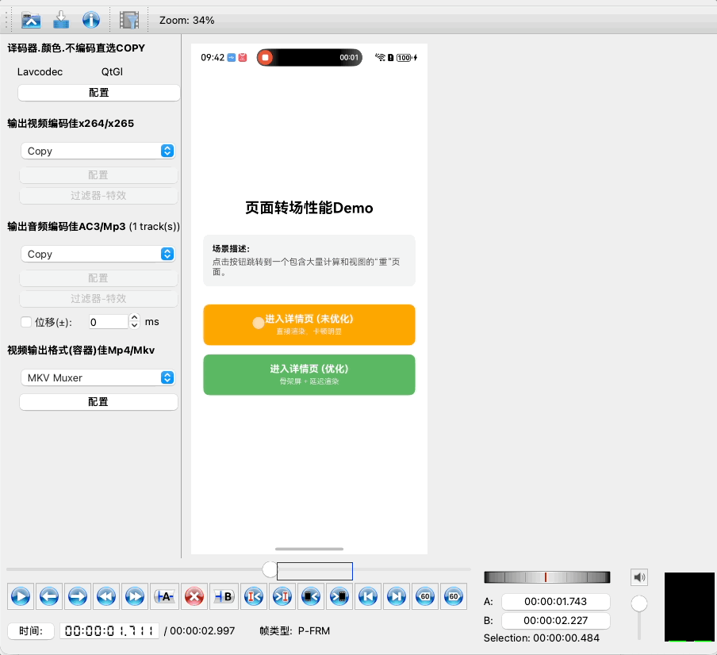
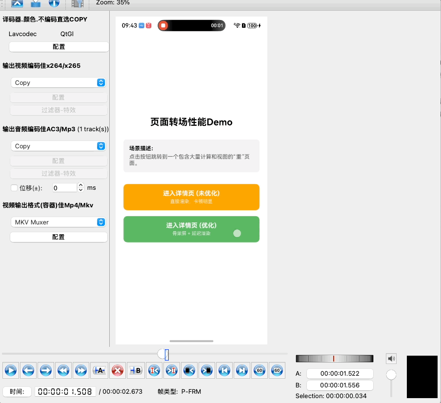
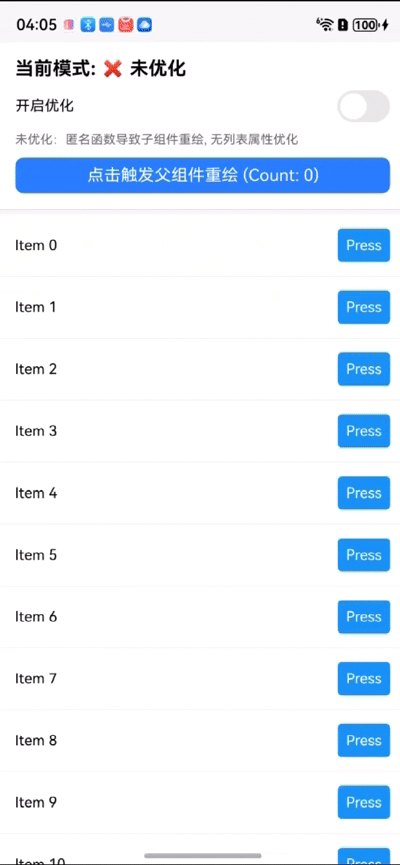
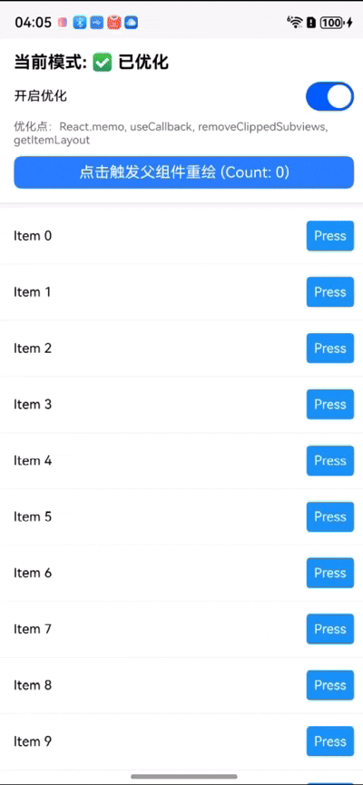

本文档针对**页面转场**和**页面滑动**两大高频卡顿场景，提供详细的优化指南。

---

## 场景一：页面转场过程中的卡顿

### 1. 卡顿的案例描述
**场景**：
在复杂业务场景中（如从商品列表跳转至详情页、Feed流进入沉浸式视频页），用户点击跳转按钮后：

1.  **响应延迟**：点击按钮后无立即反馈，界面“假死”数十毫秒。
2.  **动画掉帧**：转场动画（Push Animation）出现明显的卡顿或跳变（Jank）。
3.  **白屏时间长**：新页面进入后，需等待较长时间才展示首屏内容。

**技术归因**：
*   **JS 线程阻塞**：新页面组件树庞大，Mount 阶段的 Reconciliation（协调）与 Commit（提交）计算量过大，阻塞 JS 线程，导致动画帧无法及时计算。
*   **主线程负载**：大量 Native View 同时创建（CreateView），UI 线程瞬时负载过高。
*   **资源加载**：大图解码、Bundle 加载挤占了转场关键路径。

### 2. 优化思路与技术路线

#### 2.1 基础设施层优化
*   **毕昇编译 (Bisheng Compiler)**：开启 **LTO (Link Time Optimization)** 可减少二进制体积；开启 **PGO (Profile Guided Optimization)** 可根据热点代码优化指令排布，提升冷启动和转场速度。您可以在[毕昇文档](https://developer.huawei.com/consumer/cn/doc/harmonyos-guides/bisheng-compiler-V5)中查看更多介绍。
*   **JSVM 虚拟机**：在重载场景下，JSVM使用即时编译（JIT）技术，将JavaScript编译为本地机器码，执行效率高。您可以在[hermes引擎切换成jsvm引擎](../常见开发场景.md#由hermes-引擎切换成-jsvm-引擎)和[JSVM配置](../常见开发场景.md#如何配置jsvm启动配置项)中查看详细介绍。
*   **React 18 并发特性**：
    *   利用 **Automatic Batching**（自动批处理），RNOH 默认开启 `concurrentRoot: true`，将多次 `setState` 合并为一次 Commit，减少渲染次数。

#### 2.2 预处理策略
*   **FrameNode 预加载 RN 页面(Pre-loading)** ：
    利用 `FrameNode` 与 `NodeContainer`，在后台提前构建 RN 页面对应的原生节点树。详见[预加载RN页面](../性能调优.md#预加载RN页面)。
    *   **原理**：FrameNode 表示组件树实体节点，可脱离当前 UI 树独立存在。在空闲时提前创建目标页面的 `BuilderNode`，跳转时直接挂载，实现“秒开”。
    *   **适用场景**：高频且重资源的页面（如详情页）。

*   **预创建 RN 实例 (Pre-warming)**：
    对于独立 Bundle 的业务模块，在 App 启动阶段提前初始化 `RNInstance`，避免跳转时的 JS 引擎初始化耗时。详见[预创建RN实例](../性能调优.md#预创建RN实例)。

#### 2.3 渲染与交互优化
*   **交互优先 (InteractionManager)**：
    使用 `InteractionManager.runAfterInteractions` 将重型组件的挂载推迟到转场动画结束之后。
    
    ```tsx
    useEffect(() => {
      const task = InteractionManager.runAfterInteractions(() => {
        setIsReady(true); // 动画结束后再渲染复杂内容
      });
      return () => task.cancel();
    }, []);
    ```
    
*   **骨架屏 (Skeleton)**：
    在 `isReady` 为 false 时，展示轻量级的骨架屏。骨架屏应使用**固定宽高**的 View，避免数据加载后的布局抖动（Layout Shift）。
    
*   **React Compiler / useMemo**：
    
    *   启用 **React Compiler** 自动记忆化组件与 Hook。
        *   **配置参考**：需在 `babel.config.js` 中引入 `babel-plugin-react-compiler`。详见 [Try React Compiler 官方文档](https://react.dev/learn/react-compiler/introduction#try-react-compiler) 
    *   手动优化：对于复杂计算逻辑，严格使用 `useMemo` 缓存。

*   **固定布局与组件约束 (Fixed Layouts)**：
    *   推广组件使用固定宽高，减少 Flex 布局计算层级。
    *   限制组件的动态布局能力，避免依赖内容撑开容器，减少 Layout 阶段的重排开销。

*   **原生动画 (Native Driver)**：
    转场动画开启 `useNativeDriver: true`，将插值计算卸载到 UI 线程，避免 JS 掉帧影响动画流畅度。

### 3. 最佳实践代码样例

**方案：InteractionManager + 骨架屏 + 延迟加载**

```tsx
import React, { useState, useEffect } from 'react';
import { View, InteractionManager, StyleSheet } from 'react-native';
import { HeavyContent } from './HeavyContent'; // 假设这是一个包含大量子组件的页面
import { Skeleton } from './Skeleton';

export default function OptimizedDetailPage() {
  const [isTransitionFinished, setIsTransitionFinished] = useState(false);

  useEffect(() => {
    // 核心优化：确保转场动画流畅，动画结束后再负担 JS 线程
    const task = InteractionManager.runAfterInteractions(() => {
      setIsTransitionFinished(true);
    });
    return () => task.cancel();
  }, []);

  return (
    <View style={styles.container}>
      {isTransitionFinished ? (
        <HeavyContent />
      ) : (
        <Skeleton /> // 轻量级占位，保证转场帧率 60fps
      )}
    </View>
  );
}

const styles = StyleSheet.create({
  container: { flex: 1, backgroundColor: '#fff' }
});
```

#### 视觉效果对比 (Visual Comparison)

优化前页面跳转用时484ms，优化后页面跳转用时34ms

| 未优化 | 优化后 (InteractionManager + 骨架屏 + 延迟加载) |
| :---: | :---: |
|  |  |

---

## 场景二：页面滑动（动画）过程中的卡顿

### 1. 卡顿的案例描述
**场景**：
在长列表（FlatList/SectionList）快速滑动时：

1.  **掉帧与抖动**：FPS 波动剧烈，低于 30fps，手指感觉不跟手。
2.  **空白块 (Blank Area)**：快速滑动时，新出现的列表项是一片空白，需等待数秒才渲染出来。
3.  **吸顶卡顿**：含有 Sticky Header 的列表在吸顶瞬间发生明显停顿。

**技术归因**：
*   **渲染过频**：滚动事件触发父组件 Render，导致全量 Item Diff。
*   **Props 不稳定**：`renderItem` 中使用匿名函数或新对象，破坏 `PureComponent/memo` 优化。
*   **布局测量**：动态计算每个 Item 高度，Yoga 引擎负荷过重。

### 2. 优化思路与技术路线

#### 2.1 列表组件 (FlatList) 深度调优
*   **开启子视图剪裁 (`removeClippedSubviews`)**：
    *   **原理**：当 Item 移出可视区时，RN 会将其对应的 Native View 从 UI 树上“下树”（Detach），但保留 JS 侧的 Virtual DOM 状态。
    *   **优势**：极大降低 Native 内存占用和 GPU 绘制压力。
    *   **注意**：在某些复杂的嵌套 ScrollView 结构中可能导致内容不可见，需测试验证。
*   **避免动态测量 (`getItemLayout`)**：
    *   若 Item 高度固定，**必须**实现此方法。RN 可直接通过索引计算偏移量，无需执行异步的 Layout 测量，是长列表性能优化的分水岭。
*   **渲染窗口配置**：
    *   `initialNumToRender`：长列表不应设置过大，仅渲染首屏可见数量即可，避免启动时构建耗时过长。
    *   `windowSize`：默认 21，可适当调小（如 5-10）以减少内存驻留，以时间换空间。

#### 2.2 组件渲染与布局性能 (Render & Layout Performance)
*   **React.memo & PureComponent**：
    *   **原理**：基于浅比较（Shallow Compare）判断 Props 是否变化。若未变化，复用上次渲染结果。
    *   **缺陷与规避**：
        1.  **深层对象变异**：若 Props 是深层嵌套对象且仅修改内部属性（Mutation），浅比较无法感知。应使用 Immutable 数据结构。
        2.  **引用不稳定**：`style={{...}}` 或 `onPress={() => {}}` 会导致每次 Render 生成新引用，使 memo 失效。
*   **稳定 Props 引用**：
    *   使用 `useCallback` 缓存事件回调。
    *   将 `renderItem` 提取为独立函数或 useCallback 包裹，避免在 JSX 中内联定义。
*   **吸顶组件优化 (Sticky Header Optimization)**：
    *   严格限制吸顶组件（Sticky Headers）的复杂度。
    *   避免在吸顶组件中使用复杂的嵌套布局或动态高度，减少滑动时的合成层重绘压力。

#### 2.3 动画与任务调度
*   **动画切割 (Slicing)**：
    *   避免在 `onScroll` 回调中执行复杂逻辑。
    *   使用 `onMomentumScrollEnd`（惯性滚动结束）作为执行重型任务（如自动播放视频、埋点上报）的时机。
*   **后台任务管控 (Background Task Management)**：
    *   检查滑动过程中的并行任务，如网络请求、大图解码、复杂业务逻辑。
    *   避免在滑动窗口期执行高 CPU 消耗的操作，防止抢占 UI 线程资源。
*   **原生驱动动画**：
    *   列表内的微交互（点赞、各种 icon 动画）使用 `useNativeDriver: true`。
#### 2.4 进阶方案：引入 FlashList 

当 `FlatList` 即使经过上述调优仍无法满足性能要求时（例如渲染数千条复杂 Item），建议迁移至 **FlashList**。

*   **核心机制对比**：
    
    *   **FlatList (View Detachment)**：当 Item 移出屏幕时，FlatList 会将对应的 Native View 从视图树卸载（Detach），但可能会保留 JS 侧的组件实例。在快速滚动时，仍涉及大量的 Views 创建与销毁（Create/Drop），导致 UI 线程与 JS 线程通信频繁。
    *   **FlashList (View Recycling)**：采用真正的**视图复用**机制（类似于 Android 的 `RecyclerView` 或 iOS 的 `UICollectionView`）。当 Item 移出屏幕时，其对应的实例不会被销毁，而是被标记为“空闲”并重新填充新数据后复用到即将进入屏幕的位置。
    
*   **迁移指南**：
    FlashList 的 API 设计与 FlatList 高度兼容，通常只需几分钟即可完成迁移。
    
    1.  **安装**：https://gitee.com/react-native-oh-library/usage-docs/blob/master/zh-cn/shopify-flash-list.md
    2.  **替换组件**：将 `<FlatList>` 替换为 `<FlashList>`。
    3.  **核心属性**：必须提供 **`estimatedItemSize`**（预估 Item 高度）。这是 FlashList 能够快速计算布局且无需 `getItemLayout` 的关键。
        
        ```tsx
        <FlashList
          data={data}
          renderItem={renderItem}
          estimatedItemSize={60} // 必填：单行大致高度
        />
        ```

### 3. 最佳实践代码样例

**方案：FlatList 优化 (Memo + Layout + Config)**

```tsx
import React, { useCallback, useMemo } from 'react';
import { FlatList, View, Text, Button, StyleSheet } from 'react-native';

// 1. 使用 React.memo 锁住 Item，自定义对比函数（可选）
const OptimizedItem = React.memo(({ item, onPress }) => {
  console.log(`Render Item ${item.id}`);
  return (
    <View style={styles.item}>
      <Text>{item.title}</Text>
      <Button title="Action" onPress={() => onPress(item.id)} />
    </View>
  );
}, (prev, next) => prev.item.id === next.item.id); // 仅对比 ID 确保高效

export default function OptimizedList() {
  // 2. 保持数据源引用稳定
  const data = useMemo(() => Array.from({ length: 1000 }, (_, i) => ({ id: i, title: `Row ${i}` })), []);

  // 3. 保持回调引用稳定
  const handlePress = useCallback((id) => {
    console.log('Pressed', id);
  }, []);

  // 4. 提取 renderItem，避免匿名函数
  const renderItem = useCallback(({ item }) => (
    <OptimizedItem item={item} onPress={handlePress} />
  ), [handlePress]);

  // 5. 静态 Layout 计算
  const getItemLayout = useCallback((data, index) => ({
    length: 60, // Item 高度
    offset: 60 * index,
    index,
  }), []);

  return (
    <FlatList
      data={data}
      renderItem={renderItem}
      keyExtractor={item => item.id.toString()}
      
      // --- 核心性能属性 ---
      removeClippedSubviews={true} // 开启视图裁剪 (下树)
      getItemLayout={getItemLayout} // 跳过 Measure
      initialNumToRender={10} // 仅渲染首屏
      maxToRenderPerBatch={5} // 调优批次大小
      windowSize={5} // 减少内存占用
      
      // --- 维护性配置 ---
      contentContainerStyle={styles.listContent}
    />
  );
}

const styles = StyleSheet.create({
  listContent: { paddingBottom: 20 },
  item: { height: 60, flexDirection: 'row', alignItems: 'center', justifyContent: 'space-between', paddingHorizontal: 15 }
});
```

#### 视觉效果对比 (Visual Comparison)

在滑动相同的距离下，未优化FlatList用时更长，并且有较长的白屏时间


| 未优化 | 优化后 (Memo + Layout + Config) |
| :---: | :---: |
|  |  |