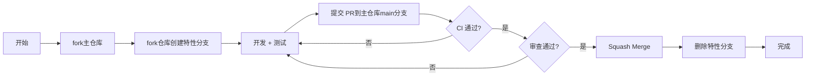

# RNOH 仓库分支管理策略与规范

## 目录

- [1. 背景与目标](#1-背景与目标)
- [2. 分支模型总览](#2-分支模型总览)
- [3. 分支类型与命名规范](#3-分支类型与命名规范)
- [4. 当前版本分支映射](#4-当前版本分支映射)
- [5. 分支操作规范](#5-分支操作规范)
- [6. 版本生命周期与维护策略](#6-版本生命周期与维护策略)
- [7. CI/CD 与分支保护](#7-cicd-与分支保护)
- [8. 常见问题 (FAQ)](#8-常见问题-faq)
- [9. 最佳实践](#9-最佳实践)
- [10. 总结](#10-总结)

---

## 1. 背景与目标

### 1.1 背景

- **组织迁移**：RN Sig 成立，RNOH仓库迁移至独立组织空间 `CPF-RN`
- **多版本并行**：维护版本（0.72、0.77、0.82）与探索版本（0.84）共存
- **治理需求**：需建立清晰、可落地的分支治理体系

### 1.2 目标

- **有序开发**：保证多版本并行开发的有序性
- **职责明确**：明确分支职责，降低协作冲突
- **双线支撑**：支撑商业版本交付与社区演进双线需求
- **质量保障**：通过流程规范保证代码质量与可追溯性

---

## 2. 分支模型总览

### 2.1 模型特点

**主干开发 + 多版本维护模式**

```
main (探索)
  ↓
0.82-main ← 0.82-feature/* ← 开发者
  ↓ cherry-pick
0.82-stable (商业发布)
```

### 2.2 分支结构

| 分支类型 | 命名规范 | 用途 |
|---------|---------|------|
| 主干 | `main` | 下一代探索开发（0.84） |
| 版本演进主干 | `${version}-main` | 对应版本的日常开发、功能迭代 |
| 商业发布分支 | `${version}-stable` | 商业版本交付，仅关键修复 |
| 特性分支 | `${version}-feature/<name>` | 大型特性隔离开发 |
| 修复分支（可选） | `${version}-hotfix/<issue>` | 紧急修复，合并至演进主干及发布分支 |

### 2.3 核心原则

1. **单向流动**：特性分支 → 演进主干 →（cherry-pick）发布分支
2. **稳定产出**：版本演进主干稳定后，产出发布分支
3. **探索隔离**：main 分支代码不直接合入正式版本
4. **修复同步**：发布分支独占修复必须同步回演进主干

---

## 3. 分支类型与命名规范

### 3.1 主干分支（main）

- **用途**：下一代版本探索开发（0.84）
- **特性**：不保证稳定性，允许实验性改动
- **权限**：Maintainer 级别可合并
- **保护规则**：
  - 必须通过 CI 检查
  - 至少 1 位 Maintainer 审批
  - 禁止 Force Push

### 3.2 版本演进主干（${version}-main）

- **用途**：对应版本的日常开发、功能迭代
- **示例**：`0.82-main`
- **特性**：相对稳定，接受特性分支合并
- **权限**：Maintainer 级别可合并
- **保护规则**：
  - 必须通过 CI 检查
  - 至少 1 位 Maintainer 审批
  - 禁止 Force Push

### 3.3 商业发布分支（${version}-stable）

- **用途**：商业版本交付，仅关键修复
- **示例**：`0.82-stable`
- **特性**：高度稳定，仅接受 cherry-pick 的修复
- **权限**：Release Manager + Maintainer
- **保护规则**：
  - 必须通过 CI 检查
  - 至少 2 位 Maintainer 审批（含 Release Manager）
  - 禁止 Force Push
  - 禁止直接合并（仅 cherry-pick）

### 3.4 特性分支（${version}-feature/<name>）

- **用途**：大型特性隔离开发
- **示例**：`0.82-feature/new-arch`
- **命名规范**：
  - 使用 kebab-case
  - 名称简洁明确，体现特性内容
  - 长度建议不超过 50 字符
- **生命周期**：完成开发后合并至对应演进主干并删除

### 3.5 修复分支（${version}-hotfix/<issue>）

- **用途**：紧急修复，需快速发布
- **示例**：`0.82-hotfix/123`（123 为 issue ID）
- **命名规范**：
  - 包含对应的 issue ID
  - 可选添加简短描述：`0.82-hotfix/123-crash-fix`
- **合并流程**：
  1. 先合并至演进主干
  2. 经测试后 cherry-pick 到发布分支
  3. 合并完成后删除

---

## 4. 当前版本分支映射

### 4.1 分支对应关系

| 版本 | 演进主干 | 商业发布分支 | 
|-----|---------|-------------|
| 0.72 | `0.72-main` | `0.72-stable` |
| 0.77 | `0.77-main` | `0.77-stable` |
| 0.82 | `0.82-main` | `0.82-stable` |
| 探索 | `main` | — |


## 5. 分支操作规范

### 5.1 分支创建

#### 5.1.1 版本演进主干

- **创建者**：版本负责人
- **触发时机**：新版本启动或重大版本升级
- **创建流程**：
  ```bash
  git checkout -b 0.82-main main
  git push -u origin 0.82-main
  ```

#### 5.1.2 商业发布分支

- **创建者**：Release Manager
- **触发时机**：演进主干达到稳定发布点
- **创建流程**：
  ```bash
  git checkout 0.82-main
  git checkout -b 0.82-stable
  git push -u origin 0.82-stable
  git tag v0.82.0-rc.1
  git push origin v0.82.0-rc.1
  ```

#### 5.1.3 特性分支

- **创建者**：开发者
- **来源分支**：对应版本的演进主干
- **创建流程**：
  ```bash
  git checkout 0.82-main
  git pull origin 0.82-main
  git checkout -b 0.82-feature/new-arch
  ```

### 5.2 分支合并

#### 5.2.1 特性分支 → 演进主干

- **前置条件**：
  - 通过 CI 检查
  - 至少 1 位 Maintainer 审批
  - 代码审查通过
- **合并方式**：
  - 优先使用 `squash merge`
  - 或使用 `--no-ff` 保留历史
- **合并后操作**：
  - 删除特性分支
  - 通知相关测试团队

#### 5.2.2 修复分支 → 发布分支

- **前置条件**：
  - 修复已在演进主干验证
  - 通过 CI 检查
  - 至少 2 位 Maintainer 审批
- **合并方式**：
  - 优先使用 `cherry-pick`
  - 禁止直接合并
- **操作流程**：
  ```bash
  # 获取修复 commit hash
  git log 0.82-main --oneline
  
  # 切换到发布分支
  git checkout 0.82-stable
  git pull origin 0.82-stable
  
  # Cherry-pick 修复
  git cherry-pick <commit-hash>
  
  # 推送
  git push origin 0.82-stable
  ```

### 5.3 标签管理

#### 5.3.1 标签格式

- **格式**：`v<version>-<stable-type>`
- **示例**：
  - `v0.82.0-rc.1`（Release Candidate）
  - `v0.82.0`（General Availability）
  - `v0.82.1-hotfix.1`（热修复版本）

#### 5.3.2 标签创建

- **创建者**：Release Manager
- **创建时机**：正式发布时
- **要求**：
  - 包含完整发布说明
  - 关联产物链接（HAR 包、Release Notes）
  - 签名标签（可选）

---

## 6. 版本生命周期与维护策略

### 6.1 维护周期表

| 版本 | 演进主干维护期 | 发布分支维护期 | 状态 |
|-----|--------------|--------------|------|
| 0.72 | 安全补丁 + 关键缺陷 | 安全补丁 + 关键缺陷 | 长期维护 |
| 0.77 | 积极维护，新特性可合入 | 同步更新 | 主力版本 |
| 0.82 | 积极维护，新特性可合入 | 同步更新 | 主力版本 |
| main | 探索开发，不保证稳定性 | — | 探索中 |

### 6.2 版本演进规则

1. **新版本稳定后**，旧版本演进主干降级为"仅关键修复"
2. **降级时机**由版本负责人发布公告明确
3. **EOL 策略**：
   - 提前 3 个月公告 EOL 计划
   - EOL 后停止接受任何修复
   - 保留代码归档，但不再维护

### 6.3 维护职责

| 角色 | 职责 |
|-----|------|
| 版本负责人 | 版本规划、分支创建、维护周期管理 |
| Release Manager | 发布分支管理、标签创建、发布流程 |
| Maintainer | 代码审查、合并决策、质量把关 |
| 开发者 | 特性开发、提交修复、遵循规范 |

---

## 7. CI/CD 与分支保护

### 7.1 分支保护规则

| 分支类型 | 保护规则 |
|---------|---------|
| `main` | CI 必需 + 1 Maintainer 审批 + 禁止 Force Push |
| `*-main` | CI 必需 + 1 Maintainer 审批 + 禁止 Force Push |
| `*-stable` | CI 必需 + 2 Maintainer 审批 + 禁止 Force Push + 禁止直接合并 |

### 7.2 CI 检查项

- **代码质量**：Lint、格式检查
- **构建检查**：各平台编译通过
- **单元测试**：测试覆盖率不低于 90%
- **集成测试**：关键场景测试通过
- **安全扫描**：无高危漏洞

### 7.3 自动化流程

1. **PR 创建**：自动触发 CI 检查
2. **合并到演进主干**：自动触发集成测试
3. **合并到发布分支**：自动触发完整测试套件 + 产物构建
4. **标签创建**：自动触发发布流程 + 通知

---

## 8. 常见问题 (FAQ)

### Q1：我应该在哪个分支提交代码？

**A**：
- 日常开发：fork对应仓库，在自己仓库完成开发及验证。完成后合回 `-main`
- 发布分支修复：先合 `-main`，验证通过后 cherry-pick 到 `-stable`
- 新版本探索性开发：在 `main` 分支进行

### Q2：多个版本需要同一个修复怎么办？

**A**：
1. 优先合入最新演进主干（如 `0.82-main`）
2. 根据影响范围 cherry-pick 到其他版本的 `-main`
3. 如需发布，再 cherry-pick 到对应的 `-stable`
4. 记录修复的 commit hash 和影响范围

### Q3：main 分支的代码可以直接合入 0.82-main 吗？

**A**：不允许直接合并。main 用于探索，若需进入正式版本，应：
- 通过特性分支在对应版本演进主干上重新实现
- 或通过 cherry-pick 选择性地移植稳定改动

### Q4：如何处理合并冲突？

**A**：
1. 在本地解决冲突
2. 运行完整测试套件
3. 请相关 Maintainer 协助审查
4. 禁止使用 `git push -f` 强制推送

### Q5：发布分支可以接受新特性吗？

**A**：不可以。发布分支仅接受：
- 关键 bug 修复
- 安全补丁
- 兼容性修复

新特性必须在演进主干开发，等待下一个发布周期。

### Q6：如何回滚发布？

**A**：
1. 创建回滚 PR（revert commit）
2. 按正常流程审查和合并
3. 重新打标签（如 `v0.82.1-ga`）
4. 更新 Release Notes 说明回滚原因

---

## 9. 最佳实践

### 9.1 开发流程



### 9.2 提交规范

- **Commit Message**：遵循 Conventional Commits 规范
  ```
  feat: add new architecture support
  fix: resolve crash on Android 14
  docs: update branch management guide
  ```
- **PR Title**：简洁明确，关联 Issue
- **PR Description**：
  - 变更说明
  - 测试情况
  - 影响范围
  - 关联 Issue

### 9.3 代码审查要点

- [ ] 代码风格符合规范
- [ ] 逻辑正确，无潜在 bug
- [ ] 测试覆盖充分
- [ ] 文档同步更新
- [ ] 无性能退化
- [ ] 安全性检查通过

### 9.4 发布检查清单

- [ ] 所有测试通过
- [ ] Release Notes 完整
- [ ] 产物构建成功
- [ ] 签名验证通过
- [ ] 向下兼容性确认
- [ ] 回滚方案准备

---

## 10. 总结

本分支管理策略旨在：

- **清晰职责**：通过明确的分支类型和命名规范，保障多版本有序迭代
- **严格流程**：通过合并规范和审查机制，保证代码质量与可追溯性
- **生命周期管理**：通过版本维护策略，明确维护边界，降低长期成本
- **自动化支撑**：通过 CI/CD 和分支保护，减少人为错误

**规范即基础设施**，为 RNOH 长期演进奠定坚实基础。

---

## 附录
### A. 联系方式

- **RN Sig 工作组**：[邮件列表]
- **技术支持**：[Issue Tracker]
- **紧急联系**：[Release Manager]

---

*文档版本：v1.0 | 最后更新：2026年3月*
