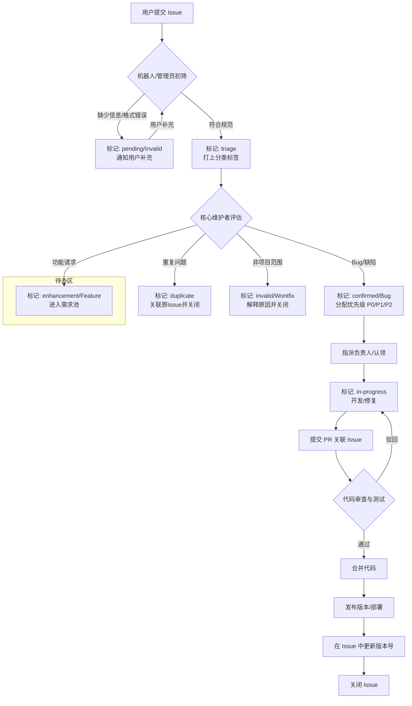
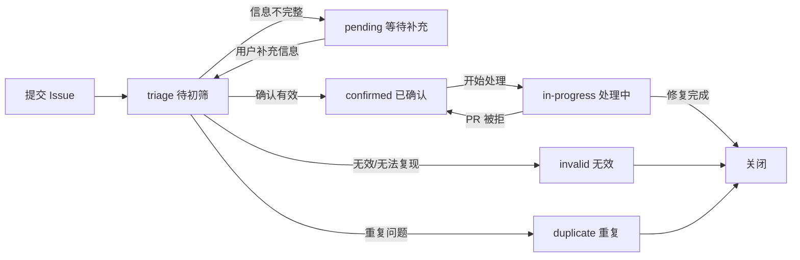

# 社区 Issue 处理规范

## 1. 目标

建立高效、透明、友好的 Issue 协作机制，确保用户反馈（Bug、需求、疑问）得到及时响应与闭环处理，提升社区。满意度和项目质量。

---

## 2. 处理 SLA（服务等级协议）

SLA 定义了从 Issue 创建到关闭的各阶段时间要求。所有社区管理员、Committer 及 Maintainer 需共同遵守。

| 等级 | 定义 | 首次响应时间 | 处理/解决时间 | 适用场景 |
| :--- | :--- | :--- | :--- | :--- |
| **P0 (紧急)** | 核心功能崩溃、数据丢失、安全漏洞、生产环境阻断 | **< 2小时** (工作时间)<br>**< 8小时** (非工作时间) | **< 24小时** | 全系统宕机、严重安全漏洞、影响范围极广的故障 |
| **P1 (高)** | 主要功能异常、无临时解决方案、影响大部分用户 | **< 8小时** | **< 3天** | 非致命但阻断业务流程、API 严重报错 |
| **P2 (中)** | 非核心功能异常、有临时绕过方案、影响小部分用户 | **< 24小时** | **< 7天** | 界面显示错位、次要功能不可用、文档错误 |
| **P3 (低)** | 优化建议、新功能请求、一般性疑问 | **< 72小时** | **< 30天** (或纳入 Roadmap) | UI 体验优化、新特性提议、非紧急咨询 |

**注：**
- **首次响应**：指由官方成员（Member/Committer）回复"收到"、"正在查看"或打上正确标签。
- **工作时间**：通常定义为 UTC+8 09:00 - 18:00（可根据社区成员分布调整）。

### 2.1 SLA 违规处理

| 违规类型 | 触发条件 | 处理措施 |
| :--- | :--- | :--- |
| 首次响应超时 | 超过 SLA 首次响应时间 | 机器人自动 @值班管理员，发送预警通知 |
| 处理超时 | 超过 SLA 解决时间 | 自动升级优先级，@技术负责人介入 |
| 长期未更新 | 14 天无任何活动 | 标记 `stale`，询问是否仍需处理 |
| 长期搁置 | 30 天无响应 | 自动关闭，用户可随时重新打开 |

---

## 3. Issue 处理流程

整个生命周期分为五个阶段：**提交 → 受理 → 处理 → 验收 → 关闭**。

### 3.1 流程图



### 3.2 状态流转说明



### 3.3 详细步骤说明

#### 3.3.1 提交阶段
- 用户必须使用**规定的 Issue 模板**提交。
- 机器人自动检查：是否包含必填字段（如版本号、日志、复现步骤）。

#### 3.3.2 受理阶段 (Triage)
- 由 **Triage 角色**（社区经理或值班维护者）在 **SLA 规定时间内** 完成初筛。
- 主要工作：检查合规性、去重、打标签（Label）、确定优先级（Priority）。

#### 3.3.3 处理阶段
- **指派**：根据标签指派给相应模块的 Maintainer 或开放给社区成员认领。
- **关联**：如果是代码缺陷，修复时必须关联 Pull Request (PR)。
- **进度更新**：超过 3 天未更新的 Issue，机器人自动评论提醒；超过 7 天无响应，按"超时冻结"处理。

#### 3.3.4 验收与关闭
- **自动化关闭**：PR 合并后，如果包含 `fixes #123` 关键词，Issue 自动关闭。
- **手动关闭**：如果是无效 Issue，由管理员关闭并注明原因。
- **用户确认**：对于复杂 Bug，修复后应由提交者验证确认后关闭。

---

## 4. Issue 分类及模板要求

为了便于自动化统计和检索，所有 Issue 必须使用模板，并规范打标签。

### 4.1 标签体系 (Labels)

建议预置以下四类标签，并配置对应颜色以增强视觉识别：

| 类别 | 标签名称 | 说明 | 推荐颜色 |
| :--- | :--- | :--- | :--- |
| **类型** | `bug` | 缺陷，程序错误 | `d73a49` (红色) |
| | `enhancement` | 现有功能的增强/优化 | `a2eeef` (青色) |
| | `feature` | 新功能请求 | `0075ca` (蓝色) |
| | `question` | 咨询/疑问 | `fbca04` (黄色) |
| | `documentation` | 文档相关 | `0e8a16` (绿色) |
| | `refactor` | 代码重构（行为不变，优化内部结构） | `7057ff` (紫色) |
| | `engineering` | 工程化改进（构建、测试、CI/CD、依赖升级等） | `5319e7` (深紫) |
| **状态** | `triage` | 待初筛 | `ededed` (灰色) |
| | `confirmed` | 已确认为有效 Issue | `128a0c` (深绿) |
| | `in-progress` | 处理中 | `ff7b00` (橙色) |
| | `pending` | 等待提交者补充信息 | `d4c5f9` (浅紫) |
| | `invalid` | 无效（格式错误、无法复现） | `e4e4e4` (浅灰) |
| | `duplicate` | 重复 | `cfd3d7` (银灰) |
| | `stale` | 长期未更新 | `9e9e9e` (中灰) |
| **优先级** | `priority/critical` | P0 | `b60205` (深红) |
| | `priority/high` | P1 | `e11d21` (亮红) |
| | `priority/medium` | P2 | `fbca04` (黄色) |
| | `priority/low` | P3 | `009800` (绿色) |
| **模块** | `module/ui` | UI 模块 | `84b6eb` (浅蓝) |
| | `module/api` | API 模块 | `5319e7` (深紫) |
| | `module/core` | 核心模块 | `1d76db` (蓝色) |
| | `module/component` | 组件 | `0e8a16` (绿色) |

### 4.2 Issue 模板要求

在项目根目录创建 `.gitcode/ISSUE_TEMPLATE/` 文件夹，至少提供以下五个核心模板：

#### 模板 1：Bug 报告

```yaml
---
name: 🐞 缺陷反馈|Bug Report
description: 当您发现了一个缺陷，需要向社区反馈时，请使用此模板。
title: "[Bug]: 【等级：严重/一般/提示】【分类：稳定性/性能/功能/工程/工具】【RNOH版本】【组件】【属性】问题描述"
 	 labels: ["bug", "triage"]
 	 type: "缺陷"
 	 body:
 	   - type: markdown
 	     attributes:
 	       value: |
 	         感谢对RN社区的支持与关注，欢迎反馈缺陷。
 	   - type: textarea
 	     id: problem
 	     attributes:
 	       label: 发生了什么问题？
 	       description: 提供尽可能多的信息描述产生了什么问题。
 	       placeholder: |
 	         1、可提供截图或视频来更清晰地说明发生的行为。
 	     validations:
 	       required: true
 	   - type: textarea
 	     id: expected-behavior
 	     attributes:
 	       label: 期望行为是什么？
 	       description: 描述期望的行为应该是什么样子的。
 	       placeholder: |
 	         1、可提供截图或视频来更清晰地说明期望的行为。
 	         2、如果期望行为与当前行为不同，请详细说明差异。
 	     validations:
 	       required: true
 	   - type: textarea
 	     id: defect-reproduction
 	     attributes:
 	       label: 如何复现该缺陷？
 	       description: 提供尽可能多的信息描述如何复现该缺陷。
 	       placeholder: |
 	         【预置条件】
 	         【测试步骤】
 	     validations:
 	       required: true
 	   - type: input
 	     id: version
 	     attributes:
 	       label: React Native OpenHarmony 版本。
 	       description: 请提供您使用的React Native OpenHarmony版本信息。
 	       placeholder: "0.72.48"
 	     validations:
 	       required: true
 	   - type: textarea
 	     id: react-native-info
 	     attributes:
 	       label: 涉及编译环境信息，请补充。
 	       description: 在您的终端中运行 `npx @react-native-community/cli info`，然后将结果粘贴到这里。
 	       placeholder: |
 	         请在此处粘贴 `npx @react-native-community/cli info` 的输出结果。 如下所示:
 	         ...
 	         System:
 	           OS: macOS 14.1.1
 	           CPU: (10) arm64 Apple M1 Max
 	           Memory: 417.81 MB / 64.00 GB
 	           Shell:
 	             version: "5.9"
 	             path: /bin/zsh
 	         Binaries:
 	           Node: ...
 	             version: 22.14.0
 	         ...
 	       render: text
 	     validations:
 	       required: true    
 	   - type: textarea
 	     id: stacktrace
 	     attributes:
 	       label: 堆栈跟踪或日志
 	       description: 请提供崩溃或故障的堆栈跟踪或日志。
 	       render: text
 	       placeholder: |
 	         请在此处粘贴堆栈跟踪或日志。它们可能看起来像这样:
 	 
 	         java.lang.UnsatisfiedLinkError: couldn't find DSO to load: libfabricjni.so caused by: com.facebook.react.fabric.StateWrapperImpl result: 0
 	             at com.facebook.soloader.SoLoader.g(Unknown Source:341)
 	             at com.facebook.soloader.SoLoader.t(Unknown Source:124)
 	             at com.facebook.soloader.SoLoader.s(Unknown Source:2)
 	             at com.facebook.soloader.SoLoader.q(Unknown Source:42)
 	             at com.facebook.soloader.SoLoader.p(Unknown Source:1)
 	             ...
 	     validations:
 	       required: true
 	   - type: textarea
 	     id: other-info
 	     attributes:
 	       label: 其他补充信息
 	       description: 补充下其他您认为需要提供的信息。
 	       render: text
 	       placeholder: |
 	         1、如果您有复现问题的公共仓库的链接，可提供链接。
 	         2、如果您认为该缺陷与特定的设备、操作系统版本或其他环境因素相关，请提供相关信息。
 	         3、如果您已经尝试过某些解决方法或绕过方法，请描述它们以及它们的效果。
 	     validations:
 	       required: false
 	   - type: checkboxes
 	     id: checklist
 	     attributes:
 	       label: 提交前检查清单
 	       description: 请在提交 Issue 前确认以下事项
 	       options:
 	         - label: 搜索现有 Issue，避免重复提交
 	           required: true
 	         - label: 使用正确的 Issue 模板
 	           required: true
 	         - label: 提供清晰的复现步骤（Bug 类）
 	           required: false
 	         - label: 附上相关日志、截图或代码片段
 	           required: false
 	         - label: 说明环境信息（操作系统、版本号等）
 	           required: true
 	         - label: 检查标题是否清晰且包含类型前缀
 	           required: true
```

#### 模板 2：功能请求

```yaml
---
name: 💡 新需求|Feature
description: 您需要反馈或实现一个新需求时，使用此模板。
title: "[新需求]: "
labels: ["feature", "triage"]
type: "需求"
body:
  - type: markdown
    attributes:
      value: |
        感谢提出新需求。
  - type: textarea
    id: feature-description
    attributes:
      label: 新需求提供了什么功能？
      description: 请描述下新需求的功能是什么，解决了什么问题？
    validations:
      required: true
  - type: textarea
    id: feature-solution
    attributes:
      label: 新需求建议方案。
      description: 请描述下您对需求方案的想法。
      placeholder: |
        1、如果您有具体的设计方案或实现方案的想法，可以在这里描述。
    validations:
      required: false    
  - type: textarea
    id: feature-value
    attributes:
      label: 该需求带来的价值、应用场景？
      description: 请描述下该需求的价值，应用场景等。
    validations:
      required: false
  - type: textarea
    id: other—info
    attributes:
      label: 其他补充信息
      description: 补充下其他您认为需要提供的信息。
      render: text
      placeholder: |
        1、如果您有其他相关信息或想法，可以在这里补充说明。
    validations:
      required: false
  - type: checkboxes
    id: checklist
    attributes:
      label: 提交前检查清单
      description: 请在提交 Issue 前确认以下事项
      options:
        - label: 搜索现有 Issue，避免重复提交
          required: true
        - label: 使用正确的 Issue 模板
          required: true
        - label: 提供清晰的描述和必要的细节
          required: true
        - label: 检查标题是否清晰且包含类型前缀
          required: true
```

#### 模板 3：咨询

```yaml
---
name: ❓ 使用咨询|Question
description: 如果您对RN社区有疑问，欢迎反馈咨询。
title: "[Question]: "
labels: ["question"]
type: "咨询"
body:
  - type: markdown
    attributes:
      value: |
        感谢提出问题，我们将安排人答复！
  - type: textarea
    id: question-description
    attributes:
      label: 问题描述
      description: 请描述下您遇到的问题
      placeholder: |
        【背景】我正在尝试做 [...]。
        【问题描述】我遇到了 [...]。
        【尝试解决方法】我尝试了 [...]，但没有成功。
        【相关代码/日志】如果有相关的代码片段或者日志信息，可以在这里提供。
    validations:
      required: true
  - type: textarea
    id: react-native-info
    attributes:
      label: 涉及编译环境信息，请补充。
      description: 在您的终端中运行 `npx @react-native-community/cli info`，然后将结果粘贴到这里。
      placeholder: |
        请在此处粘贴 `npx @react-native-community/cli info` 的输出结果。 如下所示:
        ...
        System:
          OS: macOS 14.1.1
          CPU: (10) arm64 Apple M1 Max
          Memory: 417.81 MB / 64.00 GB
          Shell:
            version: "5.9"
            path: /bin/zsh
        Binaries:
          Node: ...
            version: 22.14.0
        ...
      render: text
    validations:
      required: false      
  - type: textarea
    id: other-info
    attributes:
      label: 其他补充信息
      description: 补充下您尝试解决的方法或者其他相关信息。
      render: text
      placeholder: |
        1、如果您尝试过解决方法，可以在这里补充相关代码或者日志。
        2、如果您有其他相关信息或想法，可以在这里补充说明。
    validations:
      required: false        
  - type: checkboxes
    id: checklist
    attributes:
      label: 提交前检查清单
      description: 请在提交 Issue 前确认以下事项
      options:
        - label: 搜索现有 Issue，避免重复提交
          required: true
        - label: 使用正确的 Issue 模板
          required: true
        - label: 提供清晰的描述和必要的细节
          required: true
        - label: 检查标题是否清晰且包含类型前缀
          required: true
```

#### 模板 4：重构（Refactor）

```yaml
---
name: 🔧 代码重构
about: 优化代码结构，不改变外部行为
description: 如果您对RN社区有重构建议，欢迎反馈咨询。
title: "[Refactor]: 简短描述重构内容"
labels: ["refactor", "triage"]
type: "重构"
body:
  - type: markdown
    attributes:
      value: |
        感谢对RN社区的支持与关注，欢迎反馈。
  - type: textarea
    id: refactor-description
    attributes:
      label: 代码重构描述
      description: 请描述下您觉的需要代码重构的背景与动机。
      placeholder: |
        【重构原因】请描述下您觉得需要重构的原因是什么？是为了提升性能、改善代码结构、增加可维护性还是其他原因？
    validations:
      required: true
  - type: textarea
    id: refactor-content
    attributes:
      label: 代码重构涉及内容与验证
      description: 请提供涉及的模块与测试计划。
      placeholder: |
        【涉及模块】列出受影响的文件或模块。
        【验证计划】描述您计划如何验证重构的效果，例如通过单元测试、性能测试等。
        【预期效果】描述重构后预期达到的效果，例如性能提升、代码可读性增强等。
    validations:
      required: true      
  - type: input
    id: version
    attributes:
      label: React Native OpenHarmony 版本。
      description: 请提供您使用的React Native OpenHarmony版本信息。
      placeholder: "0.72.48"
    validations:
      required: true     
  - type: textarea
    id: other-info
    attributes:
      label: 其他信息
      description: 如果您有其他具体的重构建议或者想法，可以在这里描述。
    validations:
      required: false
  - type: checkboxes
    id: checklist
    attributes:
      label: 提交前检查清单
      description: 请在提交 Issue 前确认以下事项
      options:
        - label: 搜索现有 Issue，避免重复提交
          required: true
        - label: 使用正确的 Issue 模板
          required: true
        - label: 提供清晰的描述和必要的细节
          required: true
        - label: 检查标题是否清晰且包含类型前缀
          required: true      
```

#### 模板 5：工程（Engineering）

```yaml
---
name: 🛠️ 工程化改进|Engineering
about: 改进构建、测试、CI/CD、依赖管理等
title: "[Engineering]: 简短描述工程化改进内容"
labels: ["engineering", "triage"]
type: "工程化改进"
body:
  - type: markdown
    attributes:
      value: |
        感谢提出工程化改进建议，我们将安排人进行改进！
  - type: textarea
    id: engineering-description
    attributes:
      label: 工程化改进描述
      description: 请描述下您觉得需要工程化改进的地方。
      placeholder: |
        【改进原因】请描述下您觉得当前工程方面存在的问题或痛点（例如：构建速度慢、测试不稳定、CI 流程缺失）？
    validations:
      required: true
  - type: textarea
    id: engineering-content
    attributes:
      label: 工程化改进涉方案与验证
      description: 请提供涉及的模块与测试计划。
      placeholder: |
        【改进方案】描述具体要实施的改动，如升级依赖、增加 CI job、优化 Dockerfile 等。
        【影响范围】列出受影响的工具链、流程或开发者。
        【验证方式】说明如何验证改进有效（如 CI 通过时间缩短、测试成功率提升）。
    validations:
      required: true      
  - type: input
    id: version
    attributes:
      label: React Native OpenHarmony 版本。
      description: 请提供您使用的React Native OpenHarmony版本信息。
      placeholder: "0.72.48"
    validations:
      required: true     
  - type: textarea
    id: other-info
    attributes:
      label: 其他信息
      description: 如果您有其他具体的重构建议或者想法，可以在这里描述。
    validations:
      required: false          
  - type: checkboxes
    id: checklist
    attributes:
      label: 提交前检查清单
      description: 请在提交 Issue 前确认以下事项
      options:
        - label: 搜索现有 Issue，避免重复提交
          required: true
        - label: 使用正确的 Issue 模板
          required: true
        - label: 提供清晰的描述和必要的细节
          required: true
        - label: 检查标题是否清晰且包含类型前缀
          required: true
```

---

## 5. 角色与职责

| 角色 | 职责 |
| :--- | :--- |
| **用户 (Reporter)** | 使用规范模板提交 Issue，配合提供信息，验证修复结果 |
| **Triage 人员** | 负责初筛、打标签、分配优先级、确保 SLA 达标 |
| **维护者 (Maintainer)** | 确认 Issue 有效性，指派责任人，合并修复 PR，关闭 Issue |
| **贡献者 (Contributor)** | 认领 Issue，提交 PR 关联 Issue，遵守代码规范 |

---

## 6. 最佳实践

### 6.1 提交 Issue 前的检查清单

- [ ] 搜索现有 Issue，避免重复提交
- [ ] 使用正确的 Issue 模板
- [ ] 提供清晰的复现步骤（Bug 类）
- [ ] 附上相关日志、截图或代码片段
- [ ] 说明环境信息（操作系统、版本号等）
- [ ] 检查标题是否清晰且包含类型前缀

### 6.2 处理 Issue 的建议

- **快速响应**：即使无法立即解决，也要在 SLA 内给出首次响应
- **[WIP] 标记**：处理中 Issue 应标记 `in-progress` 或标题加 `[WIP]`
- **关联 PR**：修复 PR 必须使用 `fixes #xxx` 或 `closes #xxx` 关键词
- **版本记录**：修复完成后，在 Issue 中注明修复版本号
- **超时提醒**：利用 GitHub Actions 设置自动超时提醒机制
- **友好沟通**：即使是拒绝请求，也要给出清晰的解释和替代方案

### 6.3 常见场景处理指南

| 场景 | 处理建议 | 示例回复 |
| :--- | :--- | :--- |
| 信息不完整 | 标记 `pending`，明确指出缺少的信息 | "感谢反馈！为了更好地定位问题，请补充以下信息：1. 完整的错误日志 2. 复现步骤" |
| 重复问题 | 标记 `duplicate`，关联原 Issue | "这个问题已在 #123 中讨论，请关注原 Issue 的进展" |
| 非项目范围 | 标记 `invalid`，解释原因并建议替代方案 | "这个功能不在本项目范围内，建议使用 XXX 库来实现" |
| 需求合理但暂不排期 | 标记 `enhancement`，纳入 Roadmap | "感谢建议！这个功能已纳入 Roadmap，预计在 Q3 实现" |
| 用户提交了修复 | 感谢并引导 PR 流程 | "感谢贡献！请提交 PR 并关联此 Issue，我们会尽快 Code Review" |

### 6.4 社区沟通礼仪

- **保持尊重**：无论 Issue 质量如何，都要以友好的态度回应
- **及时更新**：处理过程中定期更新进度，让用户感知到进展
- **鼓励贡献**：对于愿意提交 PR 的用户，提供必要的指导
- **记录决策**：重要的技术决策应在 Issue 中留下记录，便于后续追溯
- **避免拖延**：如果无法及时处理，应说明原因并给出预计时间

### 6.5 机器人自动化建议

推荐配置以下自动化规则：

| 触发条件 | 自动操作 |
| :--- | :--- |
| Issue 标题不包含 `[Bug]/[Feature]/[Question]/[Refactor]/[Engineering]` | 评论提醒使用模板 |
| 3 天无更新 | 自动评论提醒 |
| 7 天无更新 | 标记 `stale`，可能自动关闭 |
| 14 天无响应 | 自动关闭，用户可重新打开 |
| PR 合并包含 `fixes #xxx` | 自动关闭对应 Issue |
| 新 Issue 提交 | 自动打 `triage` 标签 |
| Issue 包含 `help wanted` | 自动推送到社区贡献者群 |

---

## 7. 附则

本规范自发布之日起生效。

对于恶意刷 Issue、发表不当言论、提交广告的行为，管理员有权直接关闭并封禁账号。

规范解释权归社区委员会所有，并可根据项目发展阶段进行修订。
